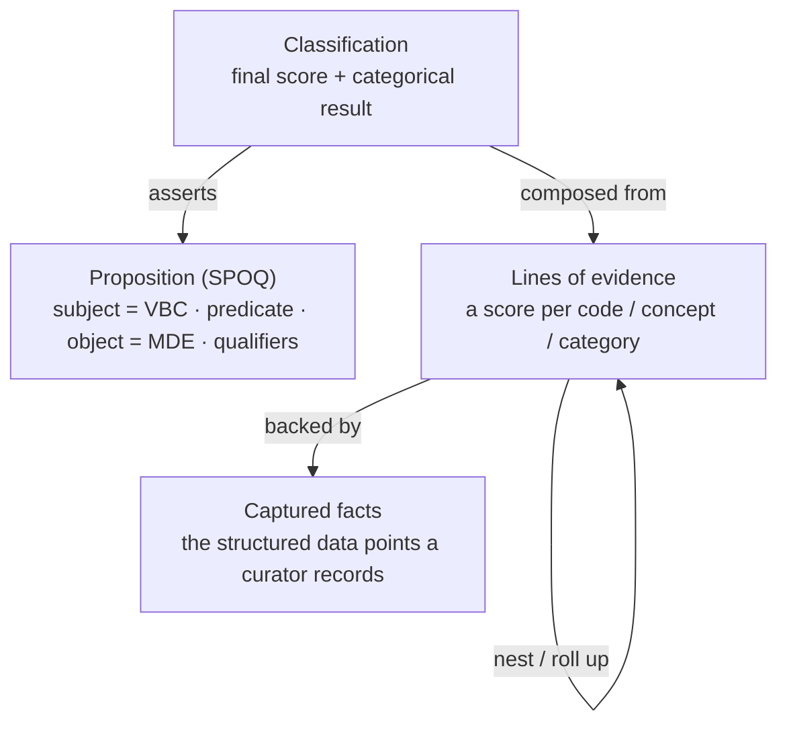

# Collecting the evidence: the shape it all rolls into

!!! info "Maturity: Stable"

    The nesting shape described here is a decision we stand behind. The
    individual parts of the arc (linked at the bottom) carry their own labels.

The cornerstone of SVCv4 — and of this model — is **showing your work with
structured evidence**. A classification isn't just a verdict; it's a verdict
*plus* the evidence and reasoning behind it, captured so others (and machines)
can see, check, and reuse it.

This section is the **capture story**: how a curator (or a producing system)
collects the evidence behind a classification and **structures it before sharing
the final outcome**. It is the side of the work that sits *underneath* the
scoring — this model captures the evidence; the scoring rules that turn it into
points live in a separate, not-yet-built method/ruleset model (of which
[ClinGen CSpec](../reference/cspec-interop.md) is one early implementer, not a
governing authority).

Throughout: **the variant = the VBC** (Variant Being Classified) and **the
disease/condition = the MDE** (Mendelian Disease Entity). See the
[Glossary](../reference/glossary.md).

## Why structure the evidence

- **Reproducible.** When the evidence behind a score is captured explicitly,
  another curator or system can follow exactly how the classification was
  reached.
- **Computable.** SVCv4 is points-based; the points come from evidence evaluated
  by workflows. Capturing that evidence in a common structure is what lets the
  scoring be applied consistently.
- **Shareable.** Structured evidence travels between tools and organizations
  without losing meaning — the whole point of a common data model.

## The one shape everything nests into

A classification is a **scored, directional claim** about a Proposition, backed
by **lines of evidence**, backed by the **captured facts**. That same shape
nests at every level, which is why the whole model can be learned once:

- A **Proposition** is the question SVCv4 answers: *does this variant cause this
  disease?* It is structured as **SPOQ** — Subject (the VBC), Predicate (the
  asserted relationship, default *is causal for*), Object (the MDE), and
  Qualifier(s) such as mode of inheritance.
- The final **classification** takes that Proposition and asserts it with a
  final score and a categorical result, made by a group or an individual.
- That result is composed from **lines of evidence** — each the scored roll-up
  for one evidence code/concept, produced by running a workflow.
- Each line of evidence is, in turn, backed by the **captured data points** a
  curator recorded: a phenotype, a zygosity, an allele frequency, a de-novo
  observation. These captured facts are the **inputs** — the thing this whole
  section is about collecting.

A line of evidence nests inside a parent line, which nests toward the final
classification — **Evidence Code → Evidence Concept → Evidence Category →
final classification**. Where related evidence could double-count, a parent
roll-up may **cap** the combined contribution. This model records **what rolled
up into what** and the captured facts underneath; it does **not** implement the
roll-up arithmetic or the capping rules — those are scoring, covered in the
[Workflows overview](../workflows/index.md) and the
[reference scoring map](../reference/scoring-map/index.md).

!!! note "One recursive shape, told two ways"

    The narrative above deliberately keeps class and property names out of the
    way. When you need the formal VA-Spec entity names — a line of evidence is a
    nested `Statement` (VA-Spec 1.1.0 folded the earlier standalone
    "EvidenceLine" class into `Statement`), and the captured facts are
    `EvidenceItem` / `EvidenceData` — see the
    [VA-Spec community profile](../reference/va-spec-profile.md),
    [Model reference](../reference/model.md), and the
    [evidence data structures catalog](../reference/evidence-structures.md).

## The arc, in four parts

The rest of this section walks the capture story once, in order. Each part ends
in **how the evidence is structured before it's shared**.

1. **[Starting curation activities](curation-activities.md)** — the setup a
   curator does before any assessment runs: the VBC, MDE, inheritance, gene, and
   transcript, plus easily-captured evidence like the gnomAD frequency and the
   computed DAFT. These are **inputs, not assessments**.
2. **[Population observations (POP)](population.md)** — `POP_FRQ` and `POP_HMZ`,
   leading with the way `POP_FRQ` can **gate** several downstream assessments.
3. **[Case & segregation data collection](case/index.md)** — the permissive
   **Case superset** that holds all case-level evidence for any CLN or LOC
   assessment, then the fields each assessment actually uses.
4. **[Variant Impact data collection](variant-impact.md)** — prediction,
   functional, splice, and informative-variant evidence, and the one shared
   pipeline it feeds.
