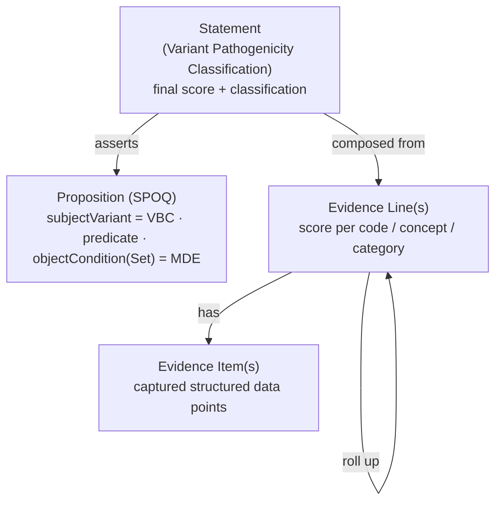

# The assertion framework

SVCv4 work starts with a **question** and ends with an **assertion**. This page
introduces that backbone simply, then links to the deeper detail.

Throughout: **the variant = the VBC** (Variant Being Considered) and **the
disease/condition = the MDE** (Mendelian Disease Entity). See the
[Glossary](../reference/glossary.md).

## Start with the Proposition

A **Proposition** is the question SVCv4 sets out to answer: *does this variant
cause this disease?* It is structured as **SPOQ** — Subject, Predicate, Object,
Qualifier(s):

- **Subject** → the **VBC** (the variant). In the VA-Spec profile this is the
  Proposition's `subjectVariant`.
- **Predicate** → the asserted relationship (default *is causal for*).
- **Object** → the **MDE** (the disease/condition). In the profile this is the
  Proposition's `objectCondition` (or `objectConditionSet` when more than one).
- **Qualifier(s)** → context such as mode of inheritance.

## Then the Statement asserts it

A **Statement** (a *Variant Pathogenicity Classification*) takes that Proposition
and asserts it with a **final score** and a categorical classification, made by a
group or an individual. The score is composed from **Evidence Lines**, each of
which rolls up the **Evidence Items** captured for a code/concept.

That's the whole arc: **Evidence Items → Evidence Lines → a Statement over a
Proposition.** The next page,
[Evidence Lines & Evidence Items](evidence-lines-and-items.md), zooms into the
two lower levels; [Capture your first case](first-case.md) shows real captured
data.

## Learn more — the `method` references

??? info "How `method` differs at the Statement vs the Evidence Line"

    The `method` slot appears at two levels and means different things:

    - **At the Statement** it identifies the **applied SVCv4 specification
      version** — baseline SVCv4 or a specific VCEP specialization selected via
      gene-disease-MoI scoping.
    - **At an Evidence Line** it identifies the **specific CSpec method/rule**
      whose invocation produced that line's score.

    Both resolve into [ClinGen CSpec](../reference/cspec-interop.md), which holds
    the authoritative definitions. The model links to them; it does not implement
    the scoring.

## See also

- [Evidence Lines & Evidence Items](evidence-lines-and-items.md)
- [How SVCv4 maps to the model](../overview/alignment.md)
- [What this project is — and isn't](../overview/scope.md)
- Model reference: [`Statement`][svcv4_model.Statement],
  [`Proposition`][svcv4_model.Proposition].
