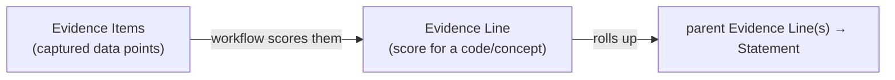

# Evidence Lines & Evidence Items

Two simple ideas sit at the bottom of every SVCv4 classification:

- An **Evidence Item** is a single **captured data point** — a structured datum
  a curator records (a phenotype, a zygosity, an allele frequency, …). In VA-Spec
  terms it's an *Information Entity*. Evidence Items are the **inputs**.
- An **Evidence Line** is a **scored roll-up** — the result of running a workflow
  over a set of Evidence Items for a given code/concept. It records which items
  were used and the **score** produced, and it contributes its score up the
  hierarchy.

In one sentence: **you capture Evidence Items; a workflow turns them into an
Evidence Line's score; scores roll up into the Statement.** (Capturing the right
items is what ["show your work"](show-your-work.md) means.)



## Learn more

??? info "Field shapes"

    ```text
    EvidenceLine                           EvidenceItem
     ├── method: Method (→ CSpec)           ├── id?: str
     ├── code?: str                         ├── type?: str
     ├── evidence: list[EvidenceItem]       ├── data: dict[str, Any]
     ├── score: float                       ├── references: list[str]
     ├── strength_direction?: str           └── description?: str
     ├── score_classification?: VPC
     ├── contribution?: float
     └── description?: str
    ```

    (`VPC` = [`VariantPathogenicityClassification`][svcv4_model.VariantPathogenicityClassification].)

??? info "How they relate to CSpec"

    ```
    EvidenceItem(s)        ──▶  workflow / CSpec method/rule  ──▶  EvidenceLine
    (curator-captured inputs)   (defined + applied in CSpec for     (records method,
                                 the chosen specification version)   evidence used, score)
    ```

    *Any process, rule, or method that produces a score maps to an Evidence
    Line.* The method's **definition** lives in [CSpec](../reference/cspec-interop.md);
    only the invocation **result** lives in the model. The same Evidence Item can
    feed more than one workflow, producing more than one Evidence Line; each line
    records the subset of items it consumed.

??? info "VA-Spec alias (EvidenceData)"

    VA-Spec uses the umbrella name **`EvidenceData`** for what this model calls
    `EvidenceItem`; they are the same class:

    ```python
    from svcv4_model import EvidenceItem, EvidenceData
    assert EvidenceData is EvidenceItem
    ```

## See also

- [The assertion framework](assertion-framework.md)
- [Summary Table](../reference/summary-table.md) — how Evidence Codes organize
  into Categories and Concepts.
- Model reference: [`EvidenceLine`][svcv4_model.EvidenceLine],
  [`EvidenceItem`][svcv4_model.EvidenceItem].
