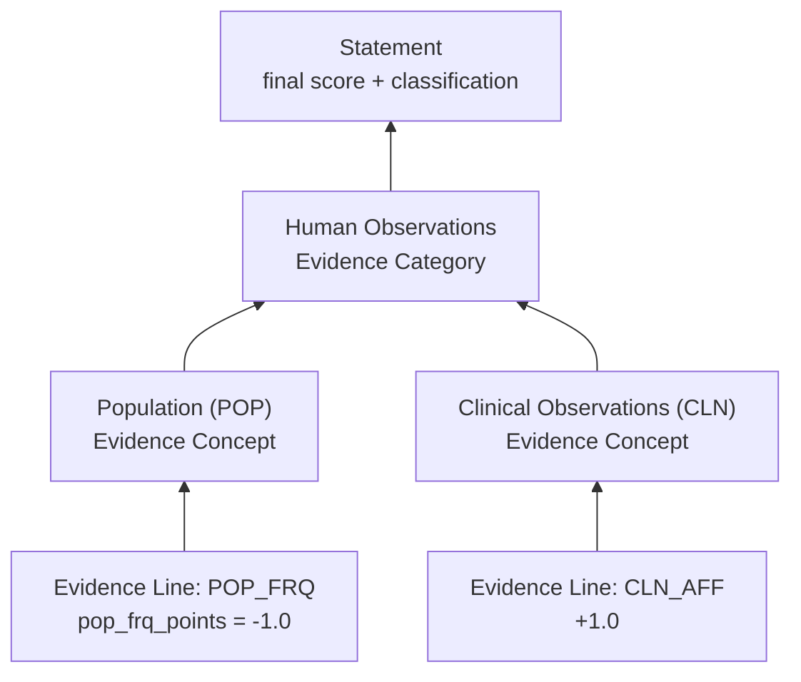

# Rolling up Evidence Line scores

A classification is rarely built from a single Evidence Line. Most real cases
accumulate several — one per Evidence Code that fired — and SVCv4 combines
them by **rolling scores up the hierarchy**: **Evidence Code → Evidence
Concept → Evidence Category → Statement**. This is the same four-level
hierarchy documented in full in [Workflows overview](../workflows/index.md);
this page just walks a concrete rollup through it.

Throughout: **the variant = the VBC** (Variant Being Classified) and **the
disease/condition = the MDE** (Mendelian Disease Entity). See the
[Glossary](../reference/glossary.md).

## Continuing the example

[Capturing basic evidence](capturing-basic-evidence.md) walked through
`POP_FRQ` producing `pop_frq_points = -1.0`, and
[Evidence Lines & Evidence Items](evidence-lines-and-items.md) showed that
score becoming one Evidence Line under the **Population (POP)** Evidence
Concept. Suppose a second Evidence Line has also been produced — say
`CLN_AFF` scored `+1.0` — under the **Clinical Observations (CLN)** Evidence
Concept. Both POP and CLN sit under the same **Human Observations** Evidence
Category.

Conceptually, here's how those two lines combine into a final score:

- Each **Evidence Line**'s score is already the roll-up for its own Evidence
  Code (`POP_FRQ`, `CLN_AFF`).
- Lines roll up into their **Evidence Concept** (POP, CLN). A concept may
  combine more than one code's lines — and, where evidence is related enough
  to double-count, the concept-level roll-up may **cap** the combined
  contribution. This model doesn't implement that capping; it's a CSpec
  method/rule (see below).
- Concepts roll up into their **Evidence Category** (Human Observations).
- Categories combine into the **Statement**'s **final score**, which maps to
  a categorical classification — SVCv4 defines a multi-tier scale spanning
  Pathogenic, Likely Pathogenic, several VUS gradations, Likely Benign, and
  Benign. The exact tiers and the score bands that produce them are still
  being finalized by the SVCv4 working group, so this page doesn't assert
  specific numbers; see
  [`VariantPathogenicityClassification`][svcv4_model.VariantPathogenicityClassification]
  for the model's current placeholder enum.

In our running example, `-1.0` from `POP_FRQ` and `+1.0` from `CLN_AFF` roll
up through their respective concepts, combine at the Human Observations
category, and (together with any Predictive & Functional Data evidence, if
present) produce the Statement's final score and classification.

## What this model captures — and what it doesn't

The Classification Model captures **what rolled up into what**: the Evidence
Line hierarchy (which lines feed which concept, which concepts feed which
category) and the Statement's final `score` and `score_classification`. It
does not implement **how** the rollup arithmetic works, or the capping rules
that prevent related evidence from being double-counted — those are methods
and rules defined in [ClinGen CSpec](../reference/cspec-interop.md), same as
the scoring behind any individual Evidence Line.

## See also

- [Workflows overview](../workflows/index.md) — the full Evidence Category →
  Concept → Code → Workflow hierarchy.
- [The assertion framework](assertion-framework.md) — formal Statement and
  Proposition definitions.
- [Evidence Lines & Evidence Items](evidence-lines-and-items.md) — formal
  Evidence Line and Evidence Item definitions.
- [Capture your first case](first-case.md) — a more complex worked example
  using a real, branching workflow (`CLN_AFF`).
- [ClinGen CSpec interop](../reference/cspec-interop.md) — where the rollup
  and capping rules actually live.
