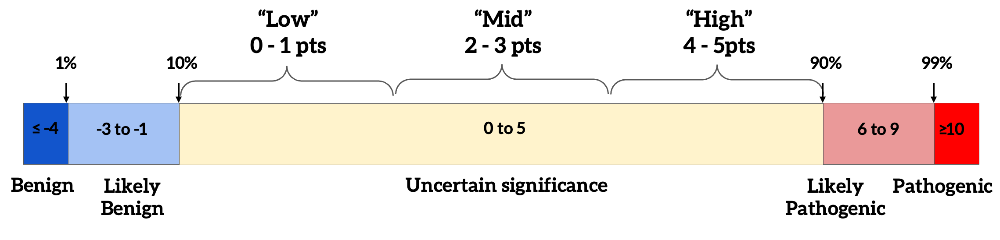

# SVCv4 Classification Model

!!! warning "Early development"

    The SVCv4 Standards have not yet been finalized and are still changing to
    varying degrees, and this model changes alongside them; the
    [Reference](reference/model.md) material is provisional for now. The narrative
    pages here are the best place to start.

> A **data model** for the **ACMG/AMP/CAP/ClinGen Sequence Variant
> Classification v4 (SVCv4)** Standards — expressed as a **GA4GH GKS VA-Spec
> community profile** — providing **standard semantic interoperability** for
> producing, exchanging, and consuming evidence-based SVCv4-compliant
> classifications.

## About this project

The **SVCv4 Standards** — the Summary Table, evidence concepts and codes, workflows,
and scoring — are defined by the **ACMG/AMP/CAP/ClinGen SVCv4 Working Group**.
The framework is theirs; it has not yet been finalized and is still changing to
varying degrees.

**This project** is a separate, coordinating effort: the **SVCv4 Standards
data-modeling team** (a task-force offshoot of the ClinGen Data Platform Working
Group). We build the **classification data model** — the structure, codes, and
uses of the SVCv4 data — to provide **standard semantic interoperability** for
producing, exchanging, and consuming evidence-based SVCv4-compliant
classifications. We do **not** author the Standards, and the scoring
**methods/rules** live in
[ClinGen's Criteria Specification (CSpec)](reference/cspec-interop.md), not here. See
[What this project is — and isn't](overview/scope.md) and
[Credits](reference/credits.md).

## Why structured evidence

SVCv4 is a **points-based** framework: each line of evidence carries a code and a
point value, and the points combine into a final classification. To get there,
the evidence behind a classification has to be **captured in a common,
structured form** — "show your work." That captured, computable evidence is what
this model standardizes, and it is the backbone of classification records that
can be created, approved, and shared across the research and clinical community.

The points-based classification bands (per the SVCv4 Working Group):

{ loading=lazy }

*SVCv4 points-based classification bands — Benign (≤ −4), Likely Benign (−3 to
−1), Uncertain significance (0 to 5; "Low" 0–1, "Mid" 2–3, "High" 4–5), Likely
Pathogenic (6 to 9), Pathogenic (≥ 10). (Figure provided by the SVCv4 Standards
group.)*

## Start here

1. [**SVCv4 Standards in brief**](overview/svcv4-in-brief.md) — a high-level primer on the framework.
2. [**How SVCv4 maps to the model**](overview/alignment.md) — the Summary Table ↔ data-model alignment.
3. [**Show your work: structured evidence**](getting-started/show-your-work.md) — why and how to capture evidence.
4. [**The assertion framework**](getting-started/assertion-framework.md) — Propositions → Variant Pathogenicity Statements.
5. [**Capture your first case**](getting-started/first-case.md) — a minimal worked example.

## Already familiar?

Jump to the [**Workflows**](workflows/index.md) (the SVCv4 Summary Table and the
clinical-observation workflows) or the [**Reference**](reference/model.md)
(model classes, JSON Schemas, vocabulary) — both provisional while the model is in
flux.

## Project context

See the [project README][readme] for the FAIR posture, broader context, and
licensing, and [Credits & acknowledgements](reference/credits.md) for the people
behind the Standards and this model.

[readme]: https://github.com/clingen-data-model/svcv4-model/blob/main/README.md
