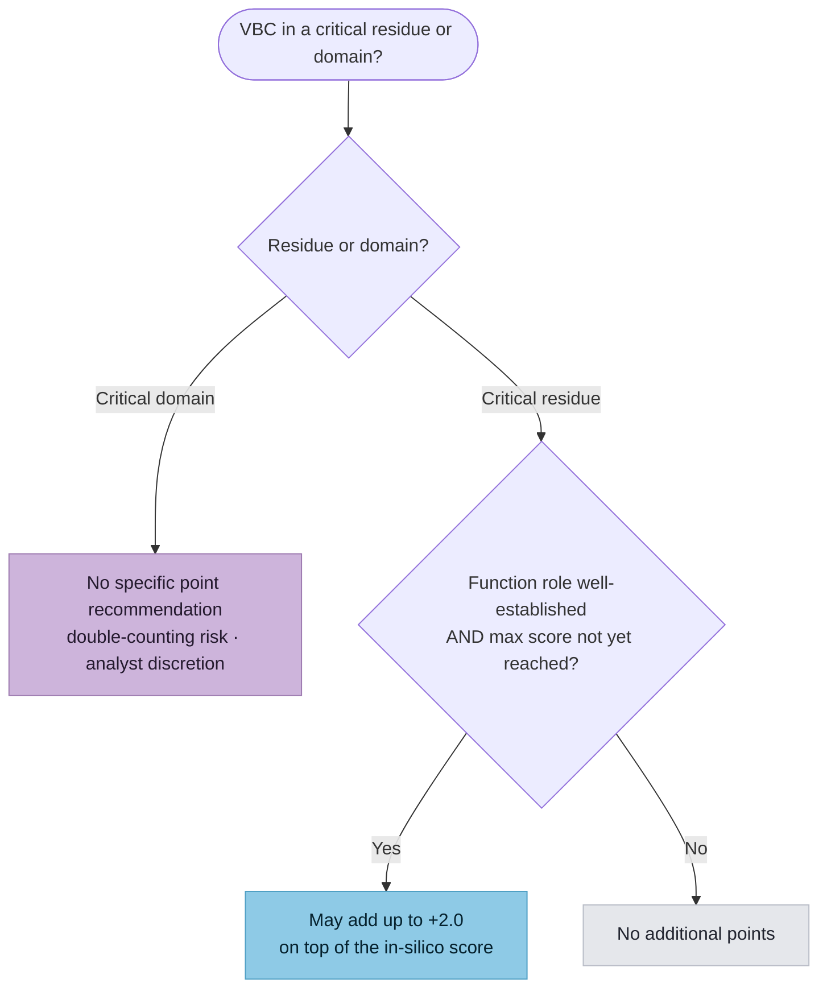

# Determining Critical Amino Acids (SM 7) Implementation Plan

> **For agentic workers:** REQUIRED: Use superpowers:subagent-driven-development (if subagents available) or superpowers:executing-plans to implement this plan. Steps use checkbox (`- [ ]`) syntax for tracking.

**Goal:** Model SM 7 as the fourth and final shared PFD submodule — a capture-only `CriticalAminoAcidEvidence` payload recording an analyst's critical-residue/domain determination and the small additional evidence (up to +2.0) that may be added on top of the in-silico predictor.

**Architecture:** New module `src/svcv4_model/critical_amino_acid.py` following the SM 18/19/20 standalone-payload shape: a two-value `CriticalityKind` StrEnum and a seven-field `CriticalAminoAcidEvidence`. No parent code, no Workflow/Case wiring. Capture + document only — NO scoring computation. Documented on the PFD index (no new page/nav), with a compact Mermaid diagram in its subsection.

**Tech Stack:** Python 3.11+, Pydantic v2, `uv`, ruff (line-length 100), pytest, mkdocs-material (strict).

---

## Task 1: The `critical_amino_acid.py` module (TDD)

**Files:**
- Create: `src/svcv4_model/critical_amino_acid.py`
- Test: `tests/test_critical_amino_acid.py`

- [ ] **Step 1: Write the failing test** — `tests/test_critical_amino_acid.py`

```python
"""Tests for the SVCv4 Determining Critical Amino Acids (SM 7) shared submodule."""

from __future__ import annotations

import pytest

from svcv4_model.critical_amino_acid import (
    CriticalAminoAcidEvidence,
    CriticalityKind,
)


def _residue_evidence() -> CriticalAminoAcidEvidence:
    return CriticalAminoAcidEvidence(
        criticality_kind=CriticalityKind.CRITICAL_RESIDUE,
        motif_or_domain_name="Gly-X-Y triple-helix glycine",
        function_role_established=True,
        additional_points=2.0,
        max_score_not_reached=True,
        observed_in_affected=True,
        double_counting_considered=True,
    )


def _domain_evidence() -> CriticalAminoAcidEvidence:
    """A critical-domain determination: SM 7 makes no specific point recommendation."""
    return CriticalAminoAcidEvidence(
        criticality_kind=CriticalityKind.CRITICAL_DOMAIN,
        motif_or_domain_name="documented critical functional domain",
        function_role_established=True,
        additional_points=0.0,
        max_score_not_reached=True,
        observed_in_affected=False,
        double_counting_considered=True,
    )


def test_residue_evidence_round_trips_json() -> None:
    original = _residue_evidence()
    rehydrated = CriticalAminoAcidEvidence.model_validate(original.model_dump(mode="json"))
    assert rehydrated == original
    assert rehydrated.criticality_kind is CriticalityKind.CRITICAL_RESIDUE


def test_domain_evidence_round_trips_json() -> None:
    original = _domain_evidence()
    rehydrated = CriticalAminoAcidEvidence.model_validate(original.model_dump(mode="json"))
    assert rehydrated == original
    assert rehydrated.criticality_kind is CriticalityKind.CRITICAL_DOMAIN


def test_evidence_is_permissive_when_empty() -> None:
    empty = CriticalAminoAcidEvidence()
    assert empty.criticality_kind is None
    assert empty.motif_or_domain_name is None
    assert empty.function_role_established is None
    assert empty.additional_points is None
    assert empty.max_score_not_reached is None
    assert empty.observed_in_affected is None
    assert empty.double_counting_considered is None


def test_evidence_forbids_extra() -> None:
    with pytest.raises(ValueError):
        CriticalAminoAcidEvidence(not_a_field=1)


def test_criticality_kind_values_round_trip() -> None:
    for kind in CriticalityKind:
        assert CriticalAminoAcidEvidence(criticality_kind=kind).criticality_kind is kind


def test_importable_from_package_root() -> None:
    import svcv4_model

    for name in ("CriticalAminoAcidEvidence", "CriticalityKind"):
        assert name in svcv4_model.__all__
```

- [ ] **Step 2: Run test to verify it fails**

Run: `uv run pytest tests/test_critical_amino_acid.py -q`
Expected: FAIL — `ModuleNotFoundError: No module named 'svcv4_model.critical_amino_acid'`

- [ ] **Step 3: Write minimal implementation** — `src/svcv4_model/critical_amino_acid.py`

```python
"""SVCv4 Determining Critical Amino Acids shared submodule (SM 7).

Guidance for when an analyst may add a small amount of evidence for a VBC that lies in a
critical residue or domain, on top of the in-silico predictor score (most commonly
MIS_PRD_). For critical domains, SM 7 makes no specific point recommendation (adding
evidence risks double-counting the strengthened in-silico predictors), though experienced
analysts may add robustly-supported evidence. For critical residues (e.g. the Gly-X-Y motif
glycine in collagens; Cys-Cys bridge cysteines in FBN1/NOTCH3; C2H2 zinc-finger cys/his in
GLI3), an analyst may add up to +2.0 points, only if the residue's functional role is
well-established and the PRD+INF combination has not already reached its maximum cap. This
submodule captures the analyst's inputs; the scoring is documented, not computed. SM 7 has
no parent code of its own — its points add to whichever _PRD_ applies.
"""

from __future__ import annotations

from enum import StrEnum

from pydantic import BaseModel, ConfigDict, Field


class CriticalityKind(StrEnum):
    """Whether the VBC affects a critical single residue or a critical domain (SM 7)."""

    CRITICAL_RESIDUE = "CRITICAL_RESIDUE"
    CRITICAL_DOMAIN = "CRITICAL_DOMAIN"


class CriticalAminoAcidEvidence(BaseModel):
    """SM 7 critical-residue / critical-domain inputs for a PFD predictive step.

    Standalone curation-level payload (the SM 18/19/20 pattern); permissive superset. The
    up-to-+2.0 residue cap, the two gating conditions, and the +6.0-on-prediction-alone
    caution are documented, not computed. SM 7 has no parent code; the additional points
    add to whichever ``_PRD_`` applies (most commonly ``MIS_PRD_``).
    """

    model_config = ConfigDict(extra="forbid")

    criticality_kind: CriticalityKind | None = Field(
        default=None, description="Whether the VBC affects a critical residue or a critical domain."
    )
    motif_or_domain_name: str | None = Field(
        default=None,
        description="The named motif / domain / residue role (e.g. Gly-X-Y triple-helix glycine).",
    )
    function_role_established: bool | None = Field(
        default=None,
        description="The residue's/domain's involvement in protein function is well-established.",
    )
    additional_points: float | None = Field(
        default=None,
        description="Additional evidence points added on top of in-silico (up to +2.0 for a residue).",
    )
    max_score_not_reached: bool | None = Field(
        default=None,
        description="The _PRD_ + _INF_ combination has not already reached its maximum cap.",
    )
    observed_in_affected: bool | None = Field(
        default=None,
        description="The variant has been observed in an individual affected with the MDE.",
    )
    double_counting_considered: bool | None = Field(
        default=None,
        description="The analyst confirmed this does not double-count the in-silico predictor.",
    )
```

- [ ] **Step 4: Run test to verify it passes**

Run: `uv run pytest tests/test_critical_amino_acid.py -q`
Expected: FAIL still on `test_importable_from_package_root` (names not yet in `__all__`) — passes after Task 2. All other tests PASS.

- [ ] **Step 5: Commit**

```bash
git add src/svcv4_model/critical_amino_acid.py tests/test_critical_amino_acid.py
git commit -m "feat: add Determining Critical Amino Acids (SM 7) submodule"
```

---

## Task 2: Export from the package root

**Files:**
- Modify: `src/svcv4_model/__init__.py`

- [ ] **Step 1: Add the import** — insert BETWEEN `from svcv4_model.classification import VariantPathogenicityClassification` (line 41) and `from svcv4_model.evidence_item import EvidenceData, EvidenceItem` (line 42). Module `critical_amino_acid` sorts after `classification` (`cl` < `cr`), before `evidence_item`:

```python
from svcv4_model.critical_amino_acid import (
    CriticalAminoAcidEvidence,
    CriticalityKind,
)
```

- [ ] **Step 2: Add to `__all__`** — insert the two names AFTER `"CoOccurrenceLikelihood",` (line 152) and BEFORE `"DaftCalculatorInputs",` (line 153). Alphabetical: `CoOccurrenceLikelihood` < `CriticalAminoAcidEvidence` < `CriticalityKind` < `DaftCalculatorInputs` (Co < Cr; CriticalA < Criticali, A<i; Cr < Da):

```python
    "CriticalAminoAcidEvidence",
    "CriticalityKind",
```

- [ ] **Step 3: Run the full test suite**

Run: `uv run pytest -q`
Expected: all PASS (including `test_importable_from_package_root`).

- [ ] **Step 4: Commit**

```bash
git add src/svcv4_model/__init__.py
git commit -m "feat: export Critical Amino Acids submodule from package root"
```

---

## Task 3: Generate the JSON schema

**Files:**
- Create (generated): `schemas/json/CriticalAminoAcidEvidence.schema.json`

- [ ] **Step 1: Regenerate schemas**

Run: `uv run python scripts/export_schemas.py`

- [ ] **Step 2: Verify exactly ONE new file, nothing modified**

Run: `git status --porcelain schemas/json`
Expected: exactly ONE `??` line — `CriticalAminoAcidEvidence.schema.json`. NO ` M` lines. (Unlike the variant-type workflows, this submodule has no separate predictive-evidence class, so only one schema file.) If any existing schema shows modified, STOP.

- [ ] **Step 3: Sanity-check `$defs`**

Run: `uv run python -c "import json; d=json.load(open('schemas/json/CriticalAminoAcidEvidence.schema.json')); print(sorted(d.get('\$defs',{}).keys()))"`
Expected: includes `CriticalityKind` (inlined as a `$def`).

- [ ] **Step 4: Commit**

```bash
git add schemas/json/CriticalAminoAcidEvidence.schema.json
git commit -m "chore: generate Critical Amino Acids submodule JSON schema"
```

---

## Task 4: Documentation

**Files:**
- Modify: `docs/workflows/pfd/index.md`, `docs/reference/spec-alignment.md`, `docs/reference/known-gaps.md`, `docs/reference/model.md`

(No new page, no nav entry, no per-workflow-page edits — SM 7 is a shared submodule documented on the PFD index alongside SM 18/19/20.)

- [ ] **Step 1: Add the Critical Amino Acids subsection to `pfd/index.md`** — insert BEFORE `### PFD scaffold ✅ modeled (inputs)` (line 126). New content:

````markdown
### Determining Critical Amino Acids ✅ modeled (inputs)

The fourth shared sub-module is modeled as `CriticalAminoAcidEvidence`
([Supplementary Material 7](https://docs.google.com/document/d/1a64UTev9P35YGStF7YjaprB8znWS5OC5qbBZBMMLA_s/edit)).
It captures an analyst's determination that a VBC lies in a critical residue or domain (a
`CriticalityKind`), the named motif/domain, the small additional evidence that may be added
on top of the in-silico predictor, and the SM 7 gating conditions. It has **no parent code**
of its own — the points add to whichever `_PRD_` applies (most commonly `MIS_PRD_`).



The scoring is **documented, not computed**. For **critical domains**, SM 7 makes no
specific point recommendation — v4 substantially strengthened the in-silico predictors
(which already capture much of v3's PM1 "critical domain" evidence), so adding domain points
risks *double-counting* (`double_counting_considered` records that the analyst checked this).
Not every conserved domain is critical: immunoglobulin-like domains generally do not qualify,
and a duplicated domain (e.g. the BRCA1 BRCT motif) may tolerate disruption of one copy. For
**critical residues** (e.g. the Gly-X-Y motif glycine in triple-helical collagens; Cys-Cys
bridge cysteines in FBN1/NOTCH3; the cys/his of a C2H2 zinc finger in GLI3 — SM 7 prints
"C2H4", an apparent typo), an analyst may add **up to +2.0 points**, but **only if** the
residue's functional role is well-established (`function_role_established`) **and** the
`_PRD_` + `_INF_` combination has not already reached its cap (`max_score_not_reached`). A
caution applies throughout: avoid using this to reach **+6.0 on prediction alone**,
especially for a variant never observed in an affected individual (`observed_in_affected`).
````

- [ ] **Step 2: Update the "shape of remaining work" framing** — `pfd/index.md`, lines 46-50. OLD:

```markdown
shared across all of them: Determining Critical Amino Acids, Molecular
Mechanism and Exon Relevance, Informative Variants, and Functional Assays.
Modeling these shared sub-modules first — so the variant-type workflows can
compose them — is the starting point.
```

NEW:

```markdown
shared across all of them: Determining Critical Amino Acids, Molecular
Mechanism and Exon Relevance, Informative Variants, and Functional Assays.
All four are now modeled (inputs), so the variant-type workflows can
compose them.
```

- [ ] **Step 3: Update the closing note** — `pfd/index.md`. First, line 148 OLD:

```markdown
**The three shared sub-modules and the scaffold are now modeled** (inputs). Ten
```

NEW:

```markdown
**The four shared sub-modules and the scaffold are now modeled** (inputs). Ten
```

Then lines 161-162 OLD:

```markdown
not yet released); Determining Critical Amino Acids (SM 7) and the cross-cutting scoring
computation are still to come.
```

NEW:

```markdown
not yet released); the cross-cutting scoring computation is still to come.
```

- [ ] **Step 4: Update spec-alignment.md SM 7 row** (line 16). OLD:

```markdown
| 7 | [Determining Critical Amino Acids](https://docs.google.com/document/d/1a64UTev9P35YGStF7YjaprB8znWS5OC5qbBZBMMLA_s/edit) | (shared sub-module) | Not yet modeled |
```

NEW:

```markdown
| 7 | [Determining Critical Amino Acids](https://docs.google.com/document/d/1a64UTev9P35YGStF7YjaprB8znWS5OC5qbBZBMMLA_s/edit) | (shared sub-module) | **Modeled (inputs)** — `CriticalAminoAcidEvidence` captures the critical-residue/domain determination (`CriticalityKind`), the up-to-+2.0 residue bump, and the two SM 7 gating conditions; the scoring is documented, not computed. No parent code (adds to whichever `_PRD_` applies). See [Predictive & Functional Data](../workflows/pfd/index.md) |
```

- [ ] **Step 5: Update known-gaps.md PFD row** (line 26) — count the submodules as four, and drop Critical Amino Acids from "What remains". OLD (two fragments):

```markdown
The three shared sub-modules (SM 18/19/20), the variant-agnostic scaffold
```

NEW:

```markdown
The four shared sub-modules (SM 7/18/19/20), the variant-agnostic scaffold
```

And OLD:

```markdown
What remains: Critical Amino Acids (SM 7); and the multiplier/scoring computation.
```

NEW:

```markdown
What remains: the multiplier/scoring computation.
```

- [ ] **Step 6: Append to model.md** — after the `::: svcv4_model.StopLostAssessment` block (the file's last block):

```markdown

---

::: svcv4_model.CriticalAminoAcidEvidence
```

- [ ] **Step 7: Build strict**

Run: `uv run mkdocs build --strict`
Expected: builds; only the Material sponsor banner + not-in-nav INFO list on stdout. No `WARNING`/`ERROR` referencing the index. (Mermaid renders client-side; `<br/>` is in node labels only, edge labels are plain — verify by eyeball.)

- [ ] **Step 8: Commit**

```bash
git add docs/workflows/pfd/index.md docs/reference/spec-alignment.md docs/reference/known-gaps.md docs/reference/model.md
git commit -m "docs: model Critical Amino Acids (SM 7) on the PFD index + refs"
```

---

## Task 5: Full quality gates

- [ ] **Step 1: Run everything**

```bash
uv run pytest -q
uv run ruff check .
git diff --quiet -- schemas/json docs/workflows/case-model.md && echo GATE_CLEAN || echo GATE_DIRTY
uv run mkdocs build --strict
git status --porcelain
```

Expected: pytest all pass; ruff clean; `GATE_CLEAN`; strict build clean; working tree clean except pre-existing untracked files (`docs/Docsite Review Plan.md`, the pptx, `docs/superpowers/context/`).

- [ ] **Step 2: Confirm the branch is ready** — all five tasks committed, tree clean. Ready for code review + PR.

---

## Notes for the implementer

- **Shape reference:** `mechanism.py` / `informative.py` (SM 18/19) — a standalone submodule with one enum + one model, no parent code, no Workflow/Case wiring.
- **One schema file only** (no separate predictive-evidence class). Task 3 Step 2 verifies exactly one new file.
- **Class docstrings feed the JSON schema `description`; the module docstring does not.**
- **Mermaid renders client-side** — `--strict` won't catch a syntax slip; eyeball it. Keep `<br/>` in node labels only, never in edge labels (the established lesson). **footnotes extension is NOT enabled.**
- **Line length is 100** (ruff), not the 79 the IDE may show.
- **Do NOT** touch the per-workflow "criticality axis (SM 7) is deferred" notes — they correctly describe deferred *scoring*; this models the *inputs*. Out of scope here.
