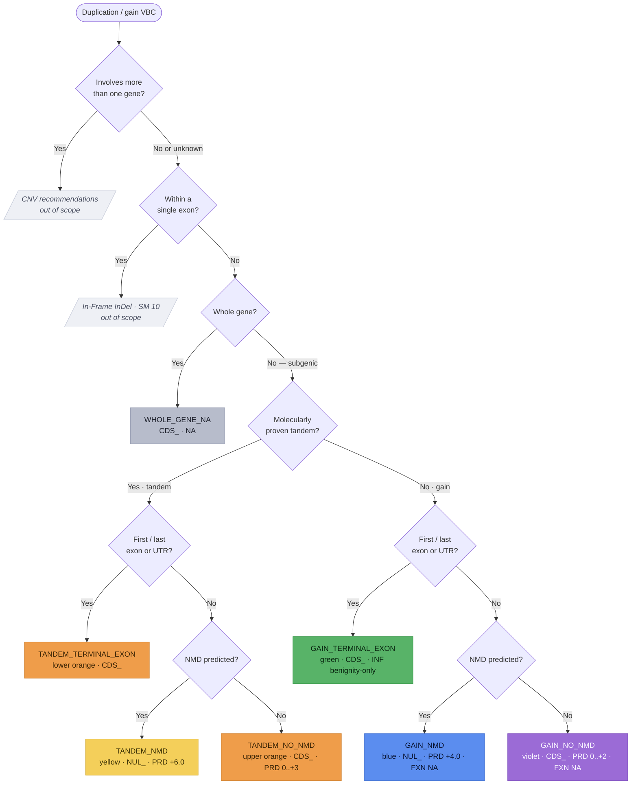

# Single/Multi-Exon Duplication/Gain Workflow Implementation Plan

> **For agentic workers:** REQUIRED: Use superpowers:subagent-driven-development (if subagents available) or superpowers:executing-plans to implement this plan. Steps use checkbox (`- [ ]`) syntax for tracking.

**Goal:** Model the SM 14 Single/Multi-Exon Duplication/Gain workflow as a capture-only `ExonDuplicationAssessment` entity (eighth per-variant-type PFD increment), routing a duplication/gain VBC down one of six scored branches plus a whole-gene NA outcome to a `NUL_`/`CDS_` parent code.

**Architecture:** New module `src/svcv4_model/exon_duplication.py` mirroring `exon_deletion.py`: a seven-value `ExonDuplicationOutcome` StrEnum, an eight-field `ExonDuplicationPredictiveEvidence`, and an `ExonDuplicationAssessment` reusing `PfdParentCode` + the SM 18/19/20 submodules. Capture + document only — NO scoring computation.

**Tech Stack:** Python 3.11+, Pydantic v2, `uv`, ruff (line-length 100), pytest, mkdocs-material (strict).

---

## Task 1: The `exon_duplication.py` module (TDD)

**Files:**
- Create: `src/svcv4_model/exon_duplication.py`
- Test: `tests/test_exon_duplication.py`

- [ ] **Step 1: Write the failing test** — `tests/test_exon_duplication.py`

```python
"""Tests for the SVCv4 Single/Multi-Exon Duplication/Gain (NUL_/CDS_) workflow model."""

from __future__ import annotations

import pytest

from svcv4_model.exon_duplication import (
    ExonDuplicationAssessment,
    ExonDuplicationOutcome,
    ExonDuplicationPredictiveEvidence,
)
from svcv4_model.functional import FunctionalAssayEvidence, ProteinFunctionalAssay
from svcv4_model.informative import (
    InformativeVariant,
    InformativeVariantsEvidence,
    VariantClassification,
)
from svcv4_model.mechanism import ExonRelevance, MechanismExonRelevanceEvidence
from svcv4_model.pfd import PfdParentCode


def _maximal_assessment() -> ExonDuplicationAssessment:
    return ExonDuplicationAssessment(
        prediction_outcome=ExonDuplicationOutcome.TANDEM_NMD,
        parent_code=PfdParentCode.NUL,
        predictive=ExonDuplicationPredictiveEvidence(
            basis="Molecularly-proven tandem duplication; PTC >50 bp upstream (NMD)",
            initial_points=6.0,
            molecularly_tandem=True,
            nmd_predicted=True,
            includes_terminal_exon_or_utr=False,
            orf_fraction_duplicated=0.4,
            duplicated_domain_critical=False,
            adjusted_points=6.0,
        ),
        mechanism_exon_relevance=MechanismExonRelevanceEvidence(
            exon_relevance=ExonRelevance.ALL,
        ),
        functional=FunctionalAssayEvidence(protein_assays=[ProteinFunctionalAssay()]),
        informative=InformativeVariantsEvidence(
            variants=[
                InformativeVariant(
                    id="clinvar:VCV000000131",
                    classification=VariantClassification.PATHOGENIC,
                )
            ]
        ),
        prd_points=6.0,
        fxn_points=2.0,
        inf_points=1.0,
        prd_fxn_combined=8.0,
        parent_total=9.0,
    )


def _gain_terminal_exon_assessment() -> ExonDuplicationAssessment:
    """The green (GAIN_TERMINAL_EXON) branch: CDS_, no SM 18, FXN-NA, benignity-only INF."""
    return ExonDuplicationAssessment(
        prediction_outcome=ExonDuplicationOutcome.GAIN_TERMINAL_EXON,
        parent_code=PfdParentCode.CDS,
        predictive=ExonDuplicationPredictiveEvidence(
            basis="Not proven tandem; includes first exon/UTR; no initial points",
            initial_points=0.0,
            molecularly_tandem=False,
            includes_terminal_exon_or_utr=True,
            adjusted_points=0.0,
        ),
        informative=InformativeVariantsEvidence(
            variants=[
                InformativeVariant(
                    id="clinvar:VCV000000132",
                    classification=VariantClassification.BENIGN,
                )
            ]
        ),
        prd_points=0.0,
        inf_points=-2.0,
        parent_total=-2.0,
    )


def test_assessment_round_trips_json() -> None:
    original = _maximal_assessment()
    rehydrated = ExonDuplicationAssessment.model_validate(original.model_dump(mode="json"))
    assert rehydrated == original


def test_gain_terminal_exon_assessment_round_trips_json() -> None:
    original = _gain_terminal_exon_assessment()
    rehydrated = ExonDuplicationAssessment.model_validate(original.model_dump(mode="json"))
    assert rehydrated == original
    assert rehydrated.parent_code is PfdParentCode.CDS
    assert rehydrated.functional is None


def test_assessment_is_permissive_when_empty() -> None:
    empty = ExonDuplicationAssessment()
    assert empty.prediction_outcome is None
    assert empty.parent_code is None
    assert empty.predictive is None
    assert empty.mechanism_exon_relevance is None
    assert empty.functional is None
    assert empty.informative is None
    assert empty.parent_total is None


def test_assessment_forbids_extra() -> None:
    with pytest.raises(ValueError):
        ExonDuplicationAssessment(not_a_field=1)


def test_predictive_forbids_extra() -> None:
    with pytest.raises(ValueError):
        ExonDuplicationPredictiveEvidence(not_a_field=1)


def test_prediction_outcome_values_round_trip() -> None:
    for outcome in ExonDuplicationOutcome:
        assert ExonDuplicationAssessment(prediction_outcome=outcome).prediction_outcome is outcome


def test_parent_code_accepts_nul_and_cds() -> None:
    for code in (PfdParentCode.NUL, PfdParentCode.CDS):
        assert ExonDuplicationAssessment(parent_code=code).parent_code is code


def test_importable_from_package_root() -> None:
    import svcv4_model

    for name in (
        "ExonDuplicationAssessment",
        "ExonDuplicationOutcome",
        "ExonDuplicationPredictiveEvidence",
    ):
        assert name in svcv4_model.__all__
```

- [ ] **Step 2: Run test to verify it fails**

Run: `uv run pytest tests/test_exon_duplication.py -q`
Expected: FAIL — `ModuleNotFoundError: No module named 'svcv4_model.exon_duplication'`

- [ ] **Step 3: Write minimal implementation** — `src/svcv4_model/exon_duplication.py`

```python
"""SVCv4 Single/Multi-Exon Duplication/Gain variants workflow (SM 14).

Duplications/gains of one or more exons (up to but excluding a whole gene) resolve to a
NUL_ or CDS_ parent code via one of six scored branches (plus a documented whole-gene NA
outcome) selected by a decision tree over three axes: molecularly proven tandem vs an
unproven copy-number gain, NMD predicted, and whether a terminal (first/last) exon/UTR is
included. Tandem-proven variants accrue more points than gains (only ~80% of subgenic
gains are actually tandem). The scored branches run the shared pipeline — predictive (PRD)
adjusted by the SM 18 mechanism/exon matrix, functional (FXN, SM 20; not considered on the
gain paths), informative (INF, SM 19), parent total. This module captures the analyst's
inputs; the scoring is documented, not computed.
"""

from __future__ import annotations

from enum import StrEnum

from pydantic import BaseModel, ConfigDict, Field

from svcv4_model.functional import FunctionalAssayEvidence
from svcv4_model.informative import InformativeVariantsEvidence
from svcv4_model.mechanism import MechanismExonRelevanceEvidence
from svcv4_model.pfd import PfdParentCode


class ExonDuplicationOutcome(StrEnum):
    """Which of the six scored duplication/gain branches (or whole-gene NA) applies (SM 14)."""

    TANDEM_NMD = "TANDEM_NMD"
    TANDEM_NO_NMD = "TANDEM_NO_NMD"
    TANDEM_TERMINAL_EXON = "TANDEM_TERMINAL_EXON"
    GAIN_NMD = "GAIN_NMD"
    GAIN_NO_NMD = "GAIN_NO_NMD"
    GAIN_TERMINAL_EXON = "GAIN_TERMINAL_EXON"
    WHOLE_GENE_NA = "WHOLE_GENE_NA"


class ExonDuplicationPredictiveEvidence(BaseModel):
    """The duplication/gain predictive (PRD) step of a branch (SM 14).

    Tandem NMD starts at +6.0; gain NMD at +4.0; the tandem/gain no-NMD branches derive
    initial points from the fraction of ORF duplicated (upper orange) or protein disrupted
    (violet) or the criticality of the duplicated amino acids; the terminal-exon branches
    award no initial points (SM 18 not applicable). Positive points are reduced by the
    SM 18 matrix on the branches that award them.
    """

    model_config = ConfigDict(extra="forbid")

    basis: str | None = Field(
        default=None,
        description="Predictive basis (e.g. tandem NMD; % ORF duplicated; critical domain).",
    )
    initial_points: float | None = Field(
        default=None, description="Initial PRD points before the SM 18 adjustment."
    )
    molecularly_tandem: bool | None = Field(
        default=None,
        description="VBC molecularly proven tandem (vs an unproven copy-number gain).",
    )
    nmd_predicted: bool | None = Field(
        default=None,
        description="Introduced PTC >50 bp upstream of the last exon-intron boundary predicts NMD.",
    )
    includes_terminal_exon_or_utr: bool | None = Field(
        default=None,
        description="Duplication includes the first exon, last exon, or either UTR.",
    )
    orf_fraction_duplicated: float | None = Field(
        default=None,
        description="Fraction of ORF duplicated / protein disrupted (the >50%..<10% table).",
    )
    duplicated_domain_critical: bool | None = Field(
        default=None,
        description="Duplicated amino acids alter a proven critical disease-relevant domain.",
    )
    adjusted_points: float | None = Field(
        default=None, description="Coded PRD points after the SM 18 adjustment."
    )


class ExonDuplicationAssessment(BaseModel):
    """A single/multi-exon duplication/gain (NUL_/CDS_) assessment (SM 14).

    One entity for all six scored branches plus the whole-gene NA outcome, parameterized by
    ``prediction_outcome``; reuses the SM 18/19/20 submodules and the shared ``PfdParentCode``
    (NUL/CDS). Permissive superset; the per-branch pipeline and its caps are documented, not
    computed. ``functional`` is left unset on the gain paths (blue/violet/green), where SM 14
    codes functional data as NA.
    """

    model_config = ConfigDict(extra="forbid")

    prediction_outcome: ExonDuplicationOutcome | None = Field(
        default=None, description="Which of the six scored branches (or whole-gene NA) applies."
    )
    parent_code: PfdParentCode | None = Field(
        default=None, description="The resolved parent code (NUL or CDS per branch)."
    )
    predictive: ExonDuplicationPredictiveEvidence | None = Field(
        default=None, description="The PRD predictive step."
    )
    mechanism_exon_relevance: MechanismExonRelevanceEvidence | None = Field(
        default=None, description="SM 18 molecular-mechanism & exon-relevance inputs."
    )
    functional: FunctionalAssayEvidence | None = Field(
        default=None, description="SM 20 functional-assay evidence (FXN); NA on the gain paths."
    )
    informative: InformativeVariantsEvidence | None = Field(
        default=None, description="SM 19 informative-variants evidence (INF)."
    )
    prd_points: float | None = Field(default=None, description="Coded PRD point value.")
    fxn_points: float | None = Field(default=None, description="Coded FXN point value.")
    inf_points: float | None = Field(default=None, description="Coded INF point value.")
    prd_fxn_combined: float | None = Field(
        default=None, description="Held PRD + FXN combined value (no distinct code)."
    )
    parent_total: float | None = Field(
        default=None, description="Capped parent-code total for this branch."
    )
```

- [ ] **Step 4: Run test to verify it passes**

Run: `uv run pytest tests/test_exon_duplication.py -q`
Expected: FAIL still on `test_importable_from_package_root` (name not yet in `__all__`) — that passes after Task 2. All other tests PASS.

- [ ] **Step 5: Commit**

```bash
git add src/svcv4_model/exon_duplication.py tests/test_exon_duplication.py
git commit -m "feat: add Single/Multi-Exon Duplication/Gain (NUL_/CDS_) workflow module"
```

---

## Task 2: Export from the package root

**Files:**
- Modify: `src/svcv4_model/__init__.py`

- [ ] **Step 1: Add the import** — insert AFTER the `exon_deletion` import block (which ends at the line `)` after `ExonDeletionPredictiveEvidence,`) and BEFORE `from svcv4_model.frameshift import (`:

```python
from svcv4_model.exon_duplication import (
    ExonDuplicationAssessment,
    ExonDuplicationOutcome,
    ExonDuplicationPredictiveEvidence,
)
```

- [ ] **Step 2: Add to `__all__`** — insert the three names AFTER `"ExonDeletionPredictiveEvidence",` and BEFORE `"ExonRelevance",` (alphabetical: ExonDeletion* < ExonDuplication* < ExonRelevance):

```python
    "ExonDuplicationAssessment",
    "ExonDuplicationOutcome",
    "ExonDuplicationPredictiveEvidence",
```

- [ ] **Step 3: Run the full test suite**

Run: `uv run pytest -q`
Expected: all PASS (including `test_importable_from_package_root`).

- [ ] **Step 4: Commit**

```bash
git add src/svcv4_model/__init__.py
git commit -m "feat: export Exon Duplication workflow from package root"
```

---

## Task 3: Generate the JSON schemas

**Files:**
- Create (generated): `schemas/json/ExonDuplicationAssessment.schema.json`, `schemas/json/ExonDuplicationPredictiveEvidence.schema.json`

- [ ] **Step 1: Regenerate schemas**

Run: `uv run python scripts/export_schemas.py` (use the actual generator script name if different; check `scripts/`).

- [ ] **Step 2: Verify exactly two new files, nothing modified**

Run: `git status --porcelain schemas/json`
Expected: exactly two `??` lines — `ExonDuplicationAssessment.schema.json` and `ExonDuplicationPredictiveEvidence.schema.json`. NO ` M` (modified) lines. If any existing schema shows modified, STOP — the module changed a shared class; investigate before continuing.

- [ ] **Step 3: Sanity-check `$defs`**

Run: `uv run python -c "import json; d=json.load(open('schemas/json/ExonDuplicationAssessment.schema.json')); print(sorted(d.get('\$defs',{}).keys()))"`
Expected: includes `ExonDuplicationOutcome`, `ExonDuplicationPredictiveEvidence`, `PfdParentCode`, and the reused SM 18/19/20 submodule defs (MechanismExonRelevanceEvidence, FunctionalAssayEvidence, InformativeVariantsEvidence, and their nested enums/models).

- [ ] **Step 4: Commit**

```bash
git add schemas/json/ExonDuplicationAssessment.schema.json schemas/json/ExonDuplicationPredictiveEvidence.schema.json
git commit -m "chore: generate Exon Duplication workflow JSON schemas"
```

---

## Task 4: Documentation

**Files:**
- Create: `docs/workflows/pfd/exon-duplication.md`
- Modify: `mkdocs.yml`, `docs/workflows/pfd/index.md`, `docs/reference/spec-alignment.md`, `docs/reference/known-gaps.md`, `docs/reference/model.md`

- [ ] **Step 1: Create the Exon Duplication workflow page** — `docs/workflows/pfd/exon-duplication.md`

````markdown
# Single/Multi-Exon Duplication/Gain variants (`NUL_` / `CDS_`)

**Single- or multi-exon duplication/gain variants** begin and end within a single gene
(the sequence ontology calls these "transcript amplification"). SVCv4 (Supplementary
Material 14) carries a decision axis the other LoF workflows do not: whether the variant
is **molecularly proven to be a tandem duplication** ("duplication") or is an **unproven
copy-number gain** ("gain"). Only ~80% of subgenic gains are actually tandem, which sits
in the VUS-High posterior range — so gains accrue fewer points than proven tandem
duplications. Each group then splits on NMD-predicted and on whether a terminal (first or
last) exon/UTR is included, routing the VBC to a `NUL_` or `CDS_` parent code through the
shared pipeline: **PRD** (predictive) → **FXN** (functional, SM 20; not considered on the
gain paths) → **INF** (informative, SM 19) → the capped parent total. Modeled as one
`ExonDuplicationAssessment` (`prediction_outcome` = `ExonDuplicationOutcome`); each step is
**documented, not computed**.

!!! note "Modeled here — inputs captured"

    Both models (`ExonDuplicationAssessment`, `ExonDuplicationPredictiveEvidence`) capture
    the analyst's inputs; the scoring is documented, not computed.

## Decision tree

The branch is selected by a decision tree over three axes — molecularly proven tandem vs
an unproven gain, whether a terminal (first/last) exon/UTR is included, and NMD-predicted.
Each terminal node is tinted its SM 14 color-path. (Diagram derived from the SM 14 flow
logic; not the source figure.)



## Branches

| Branch (`prediction_outcome`) | Tandem? | Parent | PRD initial | FXN | Parent total |
|---|---|---|---|---|---|
| `TANDEM_NMD` (yellow) | proven | `NUL_` | `+6.0` | SM 20 | `−8.0 to +10.0` |
| `TANDEM_NO_NMD` (upper orange) | proven | `CDS_` | `0.0 to +3.0` | SM 20 | `−8.0 to +10.0` |
| `TANDEM_TERMINAL_EXON` (lower orange) | proven | `CDS_` | `0.0` (no SM 18) | SM 20 | `−8.0 to +10.0` |
| `GAIN_NMD` (blue) | not proven | `NUL_` | `+4.0` | `NA` | `−1.0 to +6.0` |
| `GAIN_NO_NMD` (violet) | not proven | `CDS_` | `0.0 to +2.0` | `NA` | `−1.0 to +6.0` |
| `GAIN_TERMINAL_EXON` (green) | not proven | `CDS_` | `0.0` (no SM 18) | `NA` | `−8.0 to 0.0` |
| `WHOLE_GENE_NA` | — | `CDS_` | `NA` | `NA` | `NA` |

The parent code reuses `PfdParentCode` (`NUL` / `CDS`). The `molecularly_tandem`,
`nmd_predicted`, and `includes_terminal_exon_or_utr` predictive fields record the three
decision-tree axes that select the branch.

## Predictive (`*_PRD_`)

**Tandem-proven, subgenic, no terminal exon:** the **yellow** branch (NMD predicted)
awards a fixed **+6.0**; the **upper-orange** branch (no NMD → in-frame elongated protein)
reads **0.0 to +3.0** from the fraction of ORF duplicated (>50% → `+3.0`; <10% → `0.0`) or,
alternatively, the criticality of the duplicated amino acids (an entire proven
disease-relevant domain → `+3.0`). Both then apply the SM 18 mechanism/exon matrix.

**Not-tandem "gain", subgenic, no terminal exon:** the **blue** branch (NMD predicted)
awards a fixed **+4.0** — lower than the tandem `+6.0` for the ~80% tandem uncertainty; the
**violet** branch (no NMD) reads **0.0 to +2.0** from predicted protein disruption (>50% or
an entire experimentally-implicated critical domain → `+2.0`; <10% or unknown role → `0.0`;
low analyst confidence → `0.0`). Both then apply the SM 18 matrix.

**Terminal-exon branches (lower orange, green):** a duplication that includes the first
exon, last exon, or either UTR is unlikely to be LoF, so **no initial points** are awarded
and the SM 18 matrix is **not applicable**. (Per SM 14, the tandem lower-orange path follows
the green-path predictive logic.)

**Whole-gene duplication:** awarded `CDS_PRD_NA` — few genes have documented
triplosensitivity (see [Out of scope](#out-of-scope)).

## Functional (`*_FXN_`) and informative (`*_INF_`)

On the **tandem** paths (yellow, upper orange, lower orange) `FXN` reuses the generic
[Functional Assays](index.md#functional-assays-modeled-inputs) module
(`FunctionalAssayEvidence`, `−8.0 to +8.0`) — the assay must confirm the *predicted*
consequence (transcript/protein loss for NMD; protein elongation for the in-frame paths),
not a truncated-protein effect. On the **gain** paths (blue, violet, green) functional data
are **not considered** — coded `*_FXN_NA` — because these genomic consequences are unique
per occurrence and rarely assayed.

`INF` reuses the generic [Informative Variants](index.md#informative-variants-modeled-inputs)
module (`InformativeVariantsEvidence`, SM 19): variants duplicating a similar region
(breakpoints need not match). For pathogenicity a P/LP informative variant's effect should
be same-or-less-damaging than the VBC (and ≤ VBC ORF size); for benignity a B/LB variant's
effect should be same-or-more-damaging — +2.0 first P / +1.0 first LP / +1.0 each additional
distinct variant. The tandem paths code `INF −8.0 to +8.0`; the blue/violet gain paths code
`INF −8.0 to +6.0`. The **green** path is **benignity-only**: `−2.0` first B / `−1.0` first
LB / `−1.0` each additional — and if any P/LP informative variant exists, the analyst should
reconsider whether the green path is correct.

## Held combined value and the parent total

On the two tandem branches that award functional points, the model records **both** the
separate coded values and the one held `PRD + FXN` combined value (`prd_fxn_combined`, no
distinct code) — capped `−8.0 to +10.0` (yellow `NUL_`) or `−8.0 to +9.0` (upper-orange
`CDS_`). The lower-orange path merges its functional and informative steps with the
upper-orange path, and its parent follows the upper-orange coding (`CDS_ −8.0 to +10.0`).

The parent total (`parent_total`) is coded `NUL_ −8.0 to +10.0` (yellow), `CDS_ −8.0 to
+10.0` (upper/lower orange), `NUL_ −1.0 to +6.0` (blue), `CDS_ −1.0 to +6.0` (violet), or
`CDS_ −8.0 to 0.0` (green). The whole-gene NA outcome is coded `CDS_NA` (with `CDS_PRD_NA`,
`CDS_FXN_NA`, `CDS_INF_NA`) to document that the recommendations were evaluated and found
not applicable.

## Out of scope

Three situations are handled elsewhere and are **not** scored here: **multi-gene
duplications** (→ the CNV recommendations, PMID 31690835), **duplications beginning and
ending within a single exon** (→ [In-Frame InDel](inframe-indel.md) SM 10), and **whole-gene
duplications** (recorded as `WHOLE_GENE_NA`; few genes have curated triplosensitivity, so
classification is deferred to the CNV recommendations / expert judgment). Gain-of-function
effects are not addressed. Analytic validity matters: laboratories should calibrate their
platform's positive predictive value for detecting a gain and adjust the recommended points
downward (toward 0.0) when PPV is low or orthogonal confirmation is absent.
````

- [ ] **Step 2: Add the nav entry** — `mkdocs.yml`, after the `exon-deletion.md` line:

```yaml
          - Exon Duplication (NUL_/CDS_): workflows/pfd/exon-duplication.md
```

- [ ] **Step 3: Bump the pfd/index.md closing note** — change "Seven" → "Eight" and add the Exon Duplication sentence. OLD:

```markdown
**The three shared sub-modules and the scaffold are now modeled** (inputs). Seven
per-variant-type workflows are modeled: the full [Missense](missense.md) workflow
```

...through the Exon Deletion sentence ending:

```markdown
and the [Exon Deletion](exon-deletion.md) workflow (`NUL_`/`CDS_`, six branches). The
remaining variant-type workflows and Determining Critical Amino Acids (SM 7) are
still to come.
```

NEW: change "Seven" → "Eight" in the first line, and replace the closing Exon Deletion sentence with:

```markdown
the [Exon Deletion](exon-deletion.md) workflow (`NUL_`/`CDS_`, six branches), and the
[Exon Duplication](exon-duplication.md) workflow (`NUL_`/`CDS_`, six scored branches plus
a whole-gene NA outcome). The remaining variant-type workflows and Determining Critical
Amino Acids (SM 7) are still to come.
```

- [ ] **Step 4: Update spec-alignment.md SM 14 row** — OLD:

```markdown
| 14 | [Exon Dup/Insertion Variants](https://docs.google.com/document/d/1yMgN3Y54V3fnaV_4zjVas1aoOtwfNNyL7hziZA3EdvQ/edit) | `NUL_*`, `CDS_*` (assumed) | Not yet modeled |
```

NEW:

```markdown
| 14 | [Exon Dup/Insertion Variants](https://docs.google.com/document/d/1yMgN3Y54V3fnaV_4zjVas1aoOtwfNNyL7hziZA3EdvQ/edit) | `NUL_*`, `CDS_*` | **Modeled (inputs)** — `ExonDuplicationAssessment` captures the tandem-vs-gain axis across six scored branches (tandem NMD → `NUL_`; tandem no-NMD → `CDS_`; tandem terminal-exon → `CDS_`; gain NMD → `NUL_`; gain no-NMD → `CDS_`; gain terminal-exon → `CDS_`) plus a whole-gene NA outcome, reusing SM 18/19/20; functional data are NA on the gain paths; the criticality axis (SM 7) is deferred. See [Exon Duplication](../workflows/pfd/exon-duplication.md) |
```

- [ ] **Step 5: Update known-gaps.md PFD row** — append the Exon Duplication clause after the Exon Deletion clause. OLD (fragment):

```markdown
and the **Exon Deletion workflow** (`ExonDeletionAssessment`, six branches → `NUL_`/`CDS_`) are now modeled (inputs only).
```

NEW:

```markdown
the **Exon Deletion workflow** (`ExonDeletionAssessment`, six branches → `NUL_`/`CDS_`), and the **Exon Duplication/Gain workflow** (`ExonDuplicationAssessment`, six scored branches + whole-gene NA → `NUL_`/`CDS_`) are now modeled (inputs only).
```

(Verify the exact current wording of this fragment before editing — the Exon Deletion increment set it; match the live string.)

- [ ] **Step 6: Append to model.md** — after the `::: svcv4_model.ExonDeletionAssessment` block:

```markdown

---

::: svcv4_model.ExonDuplicationAssessment
```

- [ ] **Step 7: Build strict**

Run: `uv run mkdocs build --strict`
Expected: builds; the only stdout "warning" is the Material sponsor banner (not a build warning) and the not-in-nav INFO list of specs. No `WARNING`/`ERROR` lines referencing the new page.

- [ ] **Step 8: Commit**

```bash
git add docs/workflows/pfd/exon-duplication.md docs/workflows/pfd/index.md mkdocs.yml docs/reference/spec-alignment.md docs/reference/known-gaps.md docs/reference/model.md
git commit -m "docs: add Exon Duplication/Gain (SM 14) workflow page + refs"
```

---

## Task 5: Full quality gates

- [ ] **Step 1: Run everything**

```bash
uv run pytest -q
uv run ruff check .
git diff --quiet -- schemas/json docs/workflows/case-model.md && echo GATE_CLEAN || echo GATE_DIRTY
uv run mkdocs build --strict
git status --porcelain
```

Expected: pytest all pass; ruff clean; `GATE_CLEAN` (no existing schema or the case-model page modified — the two new schema files are already committed, so the drift gate sees no diff); strict build clean; working tree clean except pre-existing untracked files (`docs/Docsite Review Plan.md`, the pptx, `docs/superpowers/context/`).

- [ ] **Step 2: Confirm the branch is ready** — all five tasks committed, tree clean. Ready for code review + PR.

---

## Notes for the implementer

- **DRY / mirror:** `exon_duplication.py` is field-parallel to `exon_deletion.py` with a different enum + predictive fields. Do not invent new patterns; copy the shape.
- **FXN-NA paths:** there is no dedicated "NA" field — an FXN-NA branch simply leaves `functional=None` and documents the NA coding in prose. The `_gain_terminal_exon_assessment` test asserts `functional is None`.
- **Zero schema drift:** the module only ADDS two new classes; it must not touch any shared class (`PfdParentCode`, the SM 18/19/20 models). Task 3 Step 2 is the guard.
- **Module docstring vs class docstrings:** class docstrings feed the JSON schema `description`; the module docstring does not. Keep class docstrings stable once schemas are generated.
- **mkdocs footnotes are NOT enabled** — use inline parentheticals, never `[^...]`.
- **Line length is 100** (ruff), not the 79 the IDE may show.
