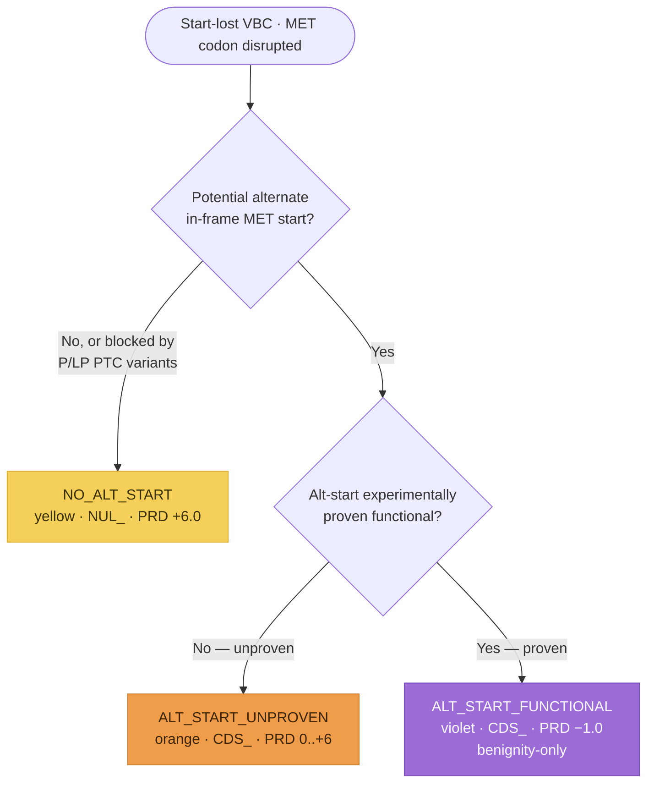

# Start-Lost Workflow Implementation Plan

> **For agentic workers:** REQUIRED: Use superpowers:subagent-driven-development (if subagents available) or superpowers:executing-plans to implement this plan. Steps use checkbox (`- [ ]`) syntax for tracking.

**Goal:** Model the SM 15 Start-Lost workflow as a capture-only `StartLostAssessment` entity (ninth per-variant-type PFD increment), routing a start-lost VBC down one of three branches to a `NUL_`/`CDS_` parent code.

**Architecture:** New module `src/svcv4_model/start_lost.py` mirroring `exon_deletion.py`: a three-value `StartLostOutcome` StrEnum, a seven-field `StartLostPredictiveEvidence`, and a `StartLostAssessment` reusing `PfdParentCode` + the SM 18/19/20 submodules. Capture + document only — NO scoring computation.

**Tech Stack:** Python 3.11+, Pydantic v2, `uv`, ruff (line-length 100), pytest, mkdocs-material (strict) with a Mermaid diagram.

---

## Task 1: The `start_lost.py` module (TDD)

**Files:**
- Create: `src/svcv4_model/start_lost.py`
- Test: `tests/test_start_lost.py`

- [ ] **Step 1: Write the failing test** — `tests/test_start_lost.py`

```python
"""Tests for the SVCv4 Start-Lost (NUL_/CDS_) workflow model."""

from __future__ import annotations

import pytest

from svcv4_model.functional import FunctionalAssayEvidence, ProteinFunctionalAssay
from svcv4_model.informative import (
    InformativeVariant,
    InformativeVariantsEvidence,
    VariantClassification,
)
from svcv4_model.mechanism import ExonRelevance, MechanismExonRelevanceEvidence
from svcv4_model.pfd import PfdParentCode
from svcv4_model.start_lost import (
    StartLostAssessment,
    StartLostOutcome,
    StartLostPredictiveEvidence,
)


def _maximal_assessment() -> StartLostAssessment:
    return StartLostAssessment(
        prediction_outcome=StartLostOutcome.NO_ALT_START,
        parent_code=PfdParentCode.NUL,
        predictive=StartLostPredictiveEvidence(
            basis="No alternate in-frame MET; P/LP PTC variants block rescue",
            initial_points=6.0,
            alternative_start_present=False,
            rescue_blocked_by_ptc=True,
            protein_fraction_lost=1.0,
            alternative_start_functional=False,
            adjusted_points=6.0,
        ),
        mechanism_exon_relevance=MechanismExonRelevanceEvidence(
            exon_relevance=ExonRelevance.ALL,
        ),
        functional=FunctionalAssayEvidence(protein_assays=[ProteinFunctionalAssay()]),
        informative=InformativeVariantsEvidence(
            variants=[
                InformativeVariant(
                    id="clinvar:VCV000000131",
                    classification=VariantClassification.PATHOGENIC,
                )
            ]
        ),
        prd_points=6.0,
        fxn_points=2.0,
        inf_points=1.0,
        prd_fxn_combined=8.0,
        parent_total=9.0,
    )


def _alt_start_functional_assessment() -> StartLostAssessment:
    """The violet (ALT_START_FUNCTIONAL) branch: CDS_, skips SM 18, benignity-only FXN/INF."""
    return StartLostAssessment(
        prediction_outcome=StartLostOutcome.ALT_START_FUNCTIONAL,
        parent_code=PfdParentCode.CDS,
        predictive=StartLostPredictiveEvidence(
            basis="Experimentally-proven functional alternative start codon",
            initial_points=-1.0,
            alternative_start_present=True,
            alternative_start_functional=True,
            adjusted_points=-1.0,
        ),
        functional=FunctionalAssayEvidence(protein_assays=[ProteinFunctionalAssay()]),
        informative=InformativeVariantsEvidence(
            variants=[
                InformativeVariant(
                    id="clinvar:VCV000000132",
                    classification=VariantClassification.BENIGN,
                )
            ]
        ),
        prd_points=-1.0,
        fxn_points=-2.0,
        inf_points=-2.0,
        parent_total=-5.0,
    )


def test_assessment_round_trips_json() -> None:
    original = _maximal_assessment()
    rehydrated = StartLostAssessment.model_validate(original.model_dump(mode="json"))
    assert rehydrated == original


def test_alt_start_functional_assessment_round_trips_json() -> None:
    original = _alt_start_functional_assessment()
    rehydrated = StartLostAssessment.model_validate(original.model_dump(mode="json"))
    assert rehydrated == original
    assert rehydrated.parent_code is PfdParentCode.CDS
    assert rehydrated.mechanism_exon_relevance is None


def test_assessment_is_permissive_when_empty() -> None:
    empty = StartLostAssessment()
    assert empty.prediction_outcome is None
    assert empty.parent_code is None
    assert empty.predictive is None
    assert empty.mechanism_exon_relevance is None
    assert empty.functional is None
    assert empty.informative is None
    assert empty.parent_total is None


def test_assessment_forbids_extra() -> None:
    with pytest.raises(ValueError):
        StartLostAssessment(not_a_field=1)


def test_predictive_forbids_extra() -> None:
    with pytest.raises(ValueError):
        StartLostPredictiveEvidence(not_a_field=1)


def test_prediction_outcome_values_round_trip() -> None:
    for outcome in StartLostOutcome:
        assert StartLostAssessment(prediction_outcome=outcome).prediction_outcome is outcome


def test_parent_code_accepts_nul_and_cds() -> None:
    for code in (PfdParentCode.NUL, PfdParentCode.CDS):
        assert StartLostAssessment(parent_code=code).parent_code is code


def test_importable_from_package_root() -> None:
    import svcv4_model

    for name in (
        "StartLostAssessment",
        "StartLostOutcome",
        "StartLostPredictiveEvidence",
    ):
        assert name in svcv4_model.__all__
```

- [ ] **Step 2: Run test to verify it fails**

Run: `uv run pytest tests/test_start_lost.py -q`
Expected: FAIL — `ModuleNotFoundError: No module named 'svcv4_model.start_lost'`

- [ ] **Step 3: Write minimal implementation** — `src/svcv4_model/start_lost.py`

```python
"""SVCv4 Start-Lost variants workflow (SM 15).

A start-lost VBC disrupts the initiator methionine (MET) codon. It resolves to a NUL_ or
CDS_ parent code via one of three branches selected at the first branch point by the
alternative start codon: none-or-blocked (yellow → NUL_), potential-but-unproven (orange →
CDS_), or experimentally-proven-functional (violet → CDS_). The yellow/orange branches run
the shared pipeline — predictive (PRD) adjusted by the SM 18 mechanism/exon matrix,
functional (FXN, SM 20), informative (INF, SM 19), parent total; the violet branch awards a
fixed -1.0, skips SM 18, and restricts FXN and INF to benignity. This module captures the
analyst's inputs; the scoring is documented, not computed.
"""

from __future__ import annotations

from enum import StrEnum

from pydantic import BaseModel, ConfigDict, Field

from svcv4_model.functional import FunctionalAssayEvidence
from svcv4_model.informative import InformativeVariantsEvidence
from svcv4_model.mechanism import MechanismExonRelevanceEvidence
from svcv4_model.pfd import PfdParentCode


class StartLostOutcome(StrEnum):
    """Which of the three start-lost branches applies to the VBC (SM 15)."""

    NO_ALT_START = "NO_ALT_START"
    ALT_START_UNPROVEN = "ALT_START_UNPROVEN"
    ALT_START_FUNCTIONAL = "ALT_START_FUNCTIONAL"


class StartLostPredictiveEvidence(BaseModel):
    """The start-lost predictive (PRD) step of a branch (SM 15).

    No-alt-start (yellow) starts at +6.0; the potential-alt-start (orange) branch derives
    initial points from the fraction of protein lost if the alternative start is used; the
    functional-alt-start (violet) branch starts at -1.0 and skips the SM 18 matrix. Positive
    points on the yellow/orange branches are reduced by the SM 18 matrix.
    """

    model_config = ConfigDict(extra="forbid")

    basis: str | None = Field(
        default=None,
        description="Predictive basis (e.g. no alt-start; % protein lost; proven alt-start).",
    )
    initial_points: float | None = Field(
        default=None, description="Initial PRD points before the SM 18 adjustment."
    )
    alternative_start_present: bool | None = Field(
        default=None, description="A potential alternate in-frame MET start codon exists."
    )
    rescue_blocked_by_ptc: bool | None = Field(
        default=None,
        description="P/LP PTC variants between the VBC and the alt-MET make rescue unlikely.",
    )
    protein_fraction_lost: float | None = Field(
        default=None,
        description="Fraction of protein lost if the alternative start is used (orange table).",
    )
    alternative_start_functional: bool | None = Field(
        default=None,
        description="The alternative start codon is experimentally shown functional (violet).",
    )
    adjusted_points: float | None = Field(
        default=None, description="Coded PRD points after the SM 18 adjustment."
    )


class StartLostAssessment(BaseModel):
    """A start-lost (NUL_/CDS_) assessment (SM 15).

    One entity for all three branches, parameterized by ``prediction_outcome``; reuses the
    SM 18/19/20 submodules and the shared ``PfdParentCode`` (NUL/CDS). Permissive superset;
    the per-branch pipeline and its caps are documented, not computed. Informative variants
    are restricted (in prose) to the +1/+2/+3 MET-codon positions.
    """

    model_config = ConfigDict(extra="forbid")

    prediction_outcome: StartLostOutcome | None = Field(
        default=None, description="Which of the three start-lost branches applies."
    )
    parent_code: PfdParentCode | None = Field(
        default=None, description="The resolved parent code (NUL or CDS per branch)."
    )
    predictive: StartLostPredictiveEvidence | None = Field(
        default=None, description="The PRD predictive step."
    )
    mechanism_exon_relevance: MechanismExonRelevanceEvidence | None = Field(
        default=None, description="SM 18 molecular-mechanism & exon-relevance inputs."
    )
    functional: FunctionalAssayEvidence | None = Field(
        default=None, description="SM 20 functional-assay evidence (FXN)."
    )
    informative: InformativeVariantsEvidence | None = Field(
        default=None, description="SM 19 informative-variants evidence (INF)."
    )
    prd_points: float | None = Field(default=None, description="Coded PRD point value.")
    fxn_points: float | None = Field(default=None, description="Coded FXN point value.")
    inf_points: float | None = Field(default=None, description="Coded INF point value.")
    prd_fxn_combined: float | None = Field(
        default=None, description="Held PRD + FXN combined value (no distinct code)."
    )
    parent_total: float | None = Field(
        default=None, description="Capped parent-code total for this branch."
    )
```

- [ ] **Step 4: Run test to verify it passes**

Run: `uv run pytest tests/test_start_lost.py -q`
Expected: FAIL still on `test_importable_from_package_root` (name not yet in `__all__`) — passes after Task 2. All other tests PASS.

- [ ] **Step 5: Commit**

```bash
git add src/svcv4_model/start_lost.py tests/test_start_lost.py
git commit -m "feat: add Start-Lost (NUL_/CDS_) workflow module"
```

---

## Task 2: Export from the package root

**Files:**
- Modify: `src/svcv4_model/__init__.py`

- [ ] **Step 1: Add the import** — insert BETWEEN the `splice` import block (ends line 121 `)`) and `from svcv4_model.statement import Statement` (line 122). Module `start_lost` sorts after `splice`, before `statement`:

```python
from svcv4_model.start_lost import (
    StartLostAssessment,
    StartLostOutcome,
    StartLostPredictiveEvidence,
)
```

- [ ] **Step 2: Add to `__all__`** — insert the three names AFTER `"SplicePredictor",` (line 203) and BEFORE `"Statement",` (line 204). Alphabetical: `Splice*` < `StartLost*` < `Statement` (Spl < Sta; StartLost "Star" < Statement "Stat", r<t):

```python
    "StartLostAssessment",
    "StartLostOutcome",
    "StartLostPredictiveEvidence",
```

- [ ] **Step 3: Run the full test suite**

Run: `uv run pytest -q`
Expected: all PASS (including `test_importable_from_package_root`).

- [ ] **Step 4: Commit**

```bash
git add src/svcv4_model/__init__.py
git commit -m "feat: export Start-Lost workflow from package root"
```

---

## Task 3: Generate the JSON schemas

**Files:**
- Create (generated): `schemas/json/StartLostAssessment.schema.json`, `schemas/json/StartLostPredictiveEvidence.schema.json`

- [ ] **Step 1: Regenerate schemas**

Run: `uv run python scripts/export_schemas.py`

- [ ] **Step 2: Verify exactly two new files, nothing modified**

Run: `git status --porcelain schemas/json`
Expected: exactly two `??` lines — `StartLostAssessment.schema.json` and `StartLostPredictiveEvidence.schema.json`. NO ` M` lines. If any existing schema shows modified, STOP.

- [ ] **Step 3: Sanity-check `$defs`**

Run: `uv run python -c "import json; d=json.load(open('schemas/json/StartLostAssessment.schema.json')); print(sorted(d.get('\$defs',{}).keys()))"`
Expected: includes `StartLostOutcome`, `StartLostPredictiveEvidence`, `PfdParentCode`, and the reused SM 18/19/20 submodule defs.

- [ ] **Step 4: Commit**

```bash
git add schemas/json/StartLostAssessment.schema.json schemas/json/StartLostPredictiveEvidence.schema.json
git commit -m "chore: generate Start-Lost workflow JSON schemas"
```

---

## Task 4: Documentation

**Files:**
- Create: `docs/workflows/pfd/start-lost.md`
- Modify: `mkdocs.yml`, `docs/workflows/pfd/index.md`, `docs/reference/spec-alignment.md`, `docs/reference/known-gaps.md`, `docs/reference/model.md`

- [ ] **Step 1: Create the Start-Lost workflow page** — `docs/workflows/pfd/start-lost.md`

````markdown
# Start-Lost variants (`NUL_` / `CDS_`)

**Start-lost variants** disrupt the initiator methionine (MET) codon. SVCv4 (Supplementary
Material 15) routes each VBC down **one** of three branches, selected at the first branch
point by the alternative start codon — is there one, and is it proven functional? Each
branch resolves to a `NUL_` or `CDS_` parent code. The yellow and orange branches run the
shared pipeline: **PRD** (predictive) → **FXN** (functional, SM 20) → **INF** (informative,
SM 19) → the capped parent total; the violet branch awards a fixed benign score. Modeled as
one `StartLostAssessment` (`prediction_outcome` = `StartLostOutcome`); each step is
**documented, not computed**.

!!! note "Modeled here — inputs captured"

    Both models (`StartLostAssessment`, `StartLostPredictiveEvidence`) capture the analyst's
    inputs; the scoring is documented, not computed.

## Decision tree

The branch is selected at the first branch point by the alternative start codon. Each
terminal node is tinted its SM 15 color-path. (Diagram derived from the SM 15 flow logic;
not the source figure.)



## Branches

| Branch (`prediction_outcome`) | Alt-start | Parent | PRD initial | Parent total |
|---|---|---|---|---|
| `NO_ALT_START` (yellow) | none, or blocked by P/LP PTC | `NUL_` | `+6.0` | `−4.0 to +10.0` |
| `ALT_START_UNPROVEN` (orange) | potential, unproven | `CDS_` | `0.0 to +6.0` | `−4.0 to +10.0` |
| `ALT_START_FUNCTIONAL` (violet) | proven functional | `CDS_` | `−1.0` (no SM 18) | `−8.0 to 0.0` |

The parent code reuses `PfdParentCode` (`NUL` / `CDS`). Note the parent floor is **−4.0**
on the yellow/orange branches (not −8.0). The `alternative_start_present`,
`rescue_blocked_by_ptc`, and `alternative_start_functional` predictive fields record the
first-branch-point decision.

## Predictive (`*_PRD_`)

The **yellow** branch applies when there is no alternate in-frame MET **or** a potential
alt-MET exists but P/LP LoF variants introduce a PTC between the VBC and the alt-MET (good
evidence rescue is unlikely — no fixed variant count; analyst judgment, variants robustly
classified or 3–4★ ClinVar). It awards a fixed **+6.0**, then applies the SM 18
mechanism/exon matrix (`NUL_PRD_0.0..+6.0`).

The **orange** branch (a plausible alt-start, no blocking P/LP PTC, no experimental data)
reads **0.0 to +6.0** from the fraction of protein deleted if the alt-start is used, or the
criticality of functional domains in the deleted segment (SM 7), then applies the SM 18
matrix (same LoF logic as yellow; `CDS_PRD_0.0..+6.0`).

The **violet** branch (an in-vitro assay shows the alternative-start protein is functional,
so a VBC upstream of it is highly likely benign) awards a fixed **−1.0** and **skips** the
SM 18 matrix (those considerations are already incorporated in the alt-start functional
evaluation).

## Functional (`*_FXN_`) and informative (`*_INF_`)

`FXN` reuses the generic [Functional Assays](index.md#functional-assays-modeled-inputs)
module (`FunctionalAssayEvidence`, `−8.0 to +8.0`, `_ND` if no data). On **yellow** the
assay must confirm transcript/protein loss (validating the translation failure); on
**orange** it must confirm the amino-terminal truncation (distinct from the data proving
alt-start usage). On **violet** `FXN` is **benignity-only** (`−8.0 to 0.0`) — pathogenic
functional data would contradict the prediction, so the analyst should reconsider the path.

`INF` reuses the generic [Informative Variants](index.md#informative-variants-modeled-inputs)
module (`InformativeVariantsEvidence`, SM 19), but is **restricted to distinct variants at
the +1/+2/+3 nucleotides of the MET codon**: +2.0 first P / +1.0 first LP or subsequent P/LP
(same MDE; pathogenicity only if similar-or-less-damaging than the VBC, benignity only if
similar-or-more-damaging). The yellow/orange branches code `INF −8.0 to +8.0`; **violet is
benignity-only** (`−8.0 to 0.0`; only B/LB at +1/+2/+3 or B/LB upstream PTC — any P/LP →
reconsider the path).

Two SM 15 specifics apply to the informative step:

- **Benignity-only extra criterion:** a B/LB variant introducing a PTC *after* the normal
  start but *upstream* of the putative alt-start counts for benignity — with no pathogenicity
  equivalent (on the yellow branch, P/LP PTC variants there were already used to award the
  initial points, so they are not re-counted as informative).
- **c.1A>C caveat (yellow/orange pathogenicity only):** because CTG can act as an initiator
  codon, a c.1A>C VBC does **not** inherit pathogenicity from P/LP variants at c.1A>T /
  c.1A>G or any +2/+3 P/LP variant.

## Held combined value and the parent total

On the yellow and orange branches the model records **both** the separate coded values and
the one held `PRD + FXN` combined value (`prd_fxn_combined`, no distinct code — orange caps
it `−8.0 to +9.0`). The parent total (`parent_total`) is coded `NUL_ −4.0 to +10.0`
(yellow), `CDS_ −4.0 to +10.0` (orange), or `CDS_ −8.0 to 0.0` (violet).

## Out of scope

Gain-of-function effects are not addressed (the workflow is LoF-framed). The SM 7
Determining Critical Amino Acids axis (the orange critical-domain criterion) is deferred,
as in every prior PFD increment.
````

- [ ] **Step 2: Add the nav entry** — `mkdocs.yml`, after the `exon-duplication.md` line (before `- Case model & applicability:`):

```yaml
          - Start Lost (NUL_/CDS_): workflows/pfd/start-lost.md
```

- [ ] **Step 3: Bump the pfd/index.md closing note** — change "Eight" → "Nine" (line 148). OLD:

```markdown
**The three shared sub-modules and the scaffold are now modeled** (inputs). Eight
```

NEW:

```markdown
**The three shared sub-modules and the scaffold are now modeled** (inputs). Nine
```

Then replace the closing Exon Duplication sentence (line 158). OLD:

```markdown
a whole-gene NA outcome). The remaining variant-type workflows and Determining Critical
Amino Acids (SM 7) are still to come.
```

NEW:

```markdown
a whole-gene NA outcome), and the [Start-Lost](start-lost.md) workflow (`NUL_`/`CDS_`, three
branches). The remaining variant-type workflows and Determining Critical Amino Acids (SM 7)
are still to come.
```

- [ ] **Step 4: Update spec-alignment.md SM 15 row** (line 24). OLD:

```markdown
| 15 | [Start Loss Variants](https://docs.google.com/document/d/1mn-IsUQSzV5traLH5G8KDa3DE1Q3OueTPfsDV9qBRvA/edit) | `NUL_*`, `CDS_*` | Not yet modeled |
```

NEW:

```markdown
| 15 | [Start Loss Variants](https://docs.google.com/document/d/1mn-IsUQSzV5traLH5G8KDa3DE1Q3OueTPfsDV9qBRvA/edit) | `NUL_*`, `CDS_*` | **Modeled (inputs)** — `StartLostAssessment` captures the three branches (no/blocked alt-start → `NUL_`; potential-unproven alt-start → `CDS_`; experimentally-functional alt-start → `CDS_`), reusing SM 18/19/20; informative variants restricted to the +1/+2/+3 MET positions; the criticality axis (SM 7) is deferred. See [Start-Lost](../workflows/pfd/start-lost.md) |
```

- [ ] **Step 5: Update known-gaps.md PFD row** (line 26) — append the Start-Lost clause. OLD (fragment):

```markdown
and the **Exon Duplication/Gain workflow** (`ExonDuplicationAssessment`, six scored branches + whole-gene NA → `NUL_`/`CDS_`) are now modeled (inputs only).
```

NEW:

```markdown
the **Exon Duplication/Gain workflow** (`ExonDuplicationAssessment`, six scored branches + whole-gene NA → `NUL_`/`CDS_`), and the **Start-Lost workflow** (`StartLostAssessment`, three branches → `NUL_`/`CDS_`) are now modeled (inputs only).
```

- [ ] **Step 6: Append to model.md** — after the `::: svcv4_model.ExonDuplicationAssessment` block (line 119):

```markdown

---

::: svcv4_model.StartLostAssessment
```

- [ ] **Step 7: Build strict**

Run: `uv run mkdocs build --strict`
Expected: builds; only stdout "warning" is the Material sponsor banner + the not-in-nav INFO list. No `WARNING`/`ERROR` referencing the new page. (The Mermaid diagram renders client-side, so `--strict` does not validate its syntax — eyeball via a rendered preview.)

- [ ] **Step 8: Commit**

```bash
git add docs/workflows/pfd/start-lost.md docs/workflows/pfd/index.md mkdocs.yml docs/reference/spec-alignment.md docs/reference/known-gaps.md docs/reference/model.md
git commit -m "docs: add Start-Lost (SM 15) workflow page + mermaid + refs"
```

---

## Task 5: Full quality gates

- [ ] **Step 1: Run everything**

```bash
uv run pytest -q
uv run ruff check .
git diff --quiet -- schemas/json docs/workflows/case-model.md && echo GATE_CLEAN || echo GATE_DIRTY
uv run mkdocs build --strict
git status --porcelain
```

Expected: pytest all pass; ruff clean; `GATE_CLEAN`; strict build clean; working tree clean except pre-existing untracked files (`docs/Docsite Review Plan.md`, the pptx, `docs/superpowers/context/`).

- [ ] **Step 2: Confirm the branch is ready** — all five tasks committed, tree clean. Ready for code review + PR.

---

## Notes for the implementer

- **DRY / mirror:** `start_lost.py` is field-parallel to `exon_deletion.py` with a different enum + predictive fields. Copy the shape; do not invent new patterns.
- **Zero schema drift:** the module only ADDS two new classes; it must not touch any shared class. Task 3 Step 2 is the guard.
- **Class docstrings feed the JSON schema `description`; the module docstring does not.** Keep class docstrings stable once schemas are generated.
- **Mermaid renders client-side** — `--strict` won't catch a syntax slip; eyeball a rendered preview. **footnotes extension is NOT enabled** — use inline parentheticals, never `[^...]`.
- **Line length is 100** (ruff), not the 79 the IDE may show.
