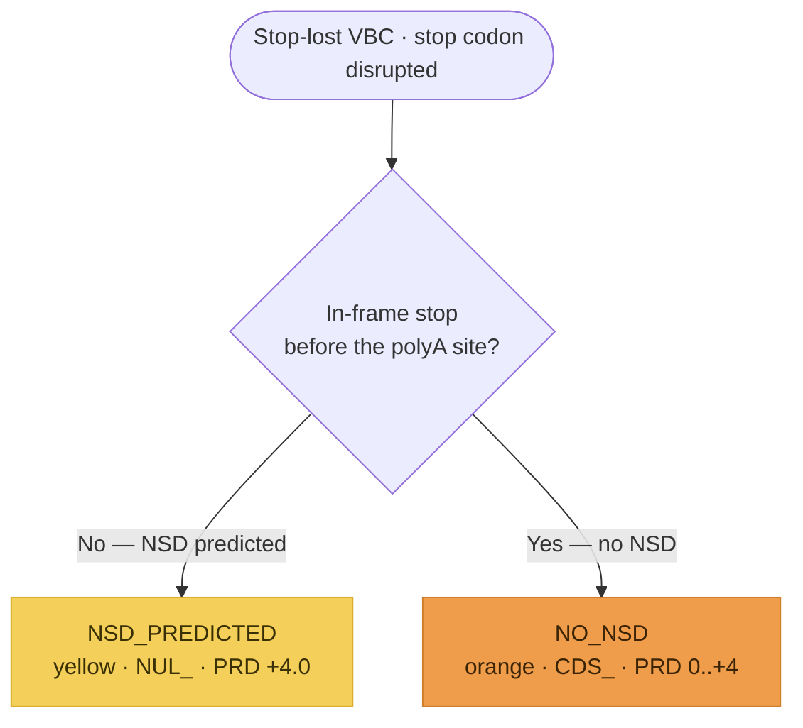

# Stop-Lost Workflow Implementation Plan

> **For agentic workers:** REQUIRED: Use superpowers:subagent-driven-development (if subagents available) or superpowers:executing-plans to implement this plan. Steps use checkbox (`- [ ]`) syntax for tracking.

**Goal:** Model the SM 16 Stop-Lost workflow as a capture-only `StopLostAssessment` entity (tenth and final per-variant-type PFD increment), routing a stop-lost VBC down one of two branches to a `NUL_`/`CDS_` parent code.

**Architecture:** New module `src/svcv4_model/stop_lost.py` mirroring `exon_deletion.py`: a two-value `StopLostOutcome` StrEnum, a three-value `StopLostInterference` StrEnum, a six-field `StopLostPredictiveEvidence`, and a `StopLostAssessment` reusing `PfdParentCode` + the SM 18/19/20 submodules. Capture + document only — NO scoring computation.

**Tech Stack:** Python 3.11+, Pydantic v2, `uv`, ruff (line-length 100), pytest, mkdocs-material (strict) with a Mermaid diagram.

---

## Task 1: The `stop_lost.py` module (TDD)

**Files:**
- Create: `src/svcv4_model/stop_lost.py`
- Test: `tests/test_stop_lost.py`

- [ ] **Step 1: Write the failing test** — `tests/test_stop_lost.py`

```python
"""Tests for the SVCv4 Stop-Lost (NUL_/CDS_) workflow model."""

from __future__ import annotations

import pytest

from svcv4_model.functional import FunctionalAssayEvidence, ProteinFunctionalAssay
from svcv4_model.informative import (
    InformativeVariant,
    InformativeVariantsEvidence,
    VariantClassification,
)
from svcv4_model.mechanism import ExonRelevance, MechanismExonRelevanceEvidence
from svcv4_model.pfd import PfdParentCode
from svcv4_model.stop_lost import (
    StopLostAssessment,
    StopLostInterference,
    StopLostOutcome,
    StopLostPredictiveEvidence,
)


def _maximal_assessment() -> StopLostAssessment:
    return StopLostAssessment(
        prediction_outcome=StopLostOutcome.NSD_PREDICTED,
        parent_code=PfdParentCode.NUL,
        predictive=StopLostPredictiveEvidence(
            basis="No in-frame stop before the polyA site; NSD predicted",
            initial_points=4.0,
            nsd_predicted=True,
            similar_variant_interference=StopLostInterference.NONE,
            extension_length_aa=45,
            adjusted_points=4.0,
        ),
        mechanism_exon_relevance=MechanismExonRelevanceEvidence(
            exon_relevance=ExonRelevance.ALL,
        ),
        functional=FunctionalAssayEvidence(protein_assays=[ProteinFunctionalAssay()]),
        informative=InformativeVariantsEvidence(
            variants=[
                InformativeVariant(
                    id="clinvar:VCV000000131",
                    classification=VariantClassification.PATHOGENIC,
                )
            ]
        ),
        prd_points=4.0,
        fxn_points=2.0,
        inf_points=1.0,
        prd_fxn_combined=6.0,
        parent_total=7.0,
    )


def _no_nsd_assessment() -> StopLostAssessment:
    """The orange (NO_NSD) branch: CDS_ with the interference/extension tier + held combined."""
    return StopLostAssessment(
        prediction_outcome=StopLostOutcome.NO_NSD,
        parent_code=PfdParentCode.CDS,
        predictive=StopLostPredictiveEvidence(
            basis="In-frame stop before polyA; similar-variant LoF; ext >30 aa",
            initial_points=4.0,
            nsd_predicted=False,
            similar_variant_interference=StopLostInterference.LOSS_OF_FUNCTION,
            extension_length_aa=52,
            adjusted_points=4.0,
        ),
        mechanism_exon_relevance=MechanismExonRelevanceEvidence(
            exon_relevance=ExonRelevance.MOST,
        ),
        functional=FunctionalAssayEvidence(protein_assays=[ProteinFunctionalAssay()]),
        informative=InformativeVariantsEvidence(
            variants=[
                InformativeVariant(
                    id="clinvar:VCV000000132",
                    classification=VariantClassification.LIKELY_PATHOGENIC,
                )
            ]
        ),
        prd_points=4.0,
        fxn_points=2.0,
        inf_points=1.0,
        prd_fxn_combined=6.0,
        parent_total=7.0,
    )


def test_assessment_round_trips_json() -> None:
    original = _maximal_assessment()
    rehydrated = StopLostAssessment.model_validate(original.model_dump(mode="json"))
    assert rehydrated == original


def test_no_nsd_assessment_round_trips_json() -> None:
    original = _no_nsd_assessment()
    rehydrated = StopLostAssessment.model_validate(original.model_dump(mode="json"))
    assert rehydrated == original
    assert rehydrated.parent_code is PfdParentCode.CDS
    assert rehydrated.prd_fxn_combined == 6.0
    pred = rehydrated.predictive
    assert pred is not None
    assert pred.similar_variant_interference is StopLostInterference.LOSS_OF_FUNCTION


def test_assessment_is_permissive_when_empty() -> None:
    empty = StopLostAssessment()
    assert empty.prediction_outcome is None
    assert empty.parent_code is None
    assert empty.predictive is None
    assert empty.mechanism_exon_relevance is None
    assert empty.functional is None
    assert empty.informative is None
    assert empty.parent_total is None


def test_assessment_forbids_extra() -> None:
    with pytest.raises(ValueError):
        StopLostAssessment(not_a_field=1)


def test_predictive_forbids_extra() -> None:
    with pytest.raises(ValueError):
        StopLostPredictiveEvidence(not_a_field=1)


def test_prediction_outcome_values_round_trip() -> None:
    for outcome in StopLostOutcome:
        assert StopLostAssessment(prediction_outcome=outcome).prediction_outcome is outcome


def test_interference_values_round_trip() -> None:
    for level in StopLostInterference:
        pred = StopLostPredictiveEvidence(similar_variant_interference=level)
        assert pred.similar_variant_interference is level


def test_parent_code_accepts_nul_and_cds() -> None:
    for code in (PfdParentCode.NUL, PfdParentCode.CDS):
        assert StopLostAssessment(parent_code=code).parent_code is code


def test_importable_from_package_root() -> None:
    import svcv4_model

    for name in (
        "StopLostAssessment",
        "StopLostInterference",
        "StopLostOutcome",
        "StopLostPredictiveEvidence",
    ):
        assert name in svcv4_model.__all__
```

- [ ] **Step 2: Run test to verify it fails**

Run: `uv run pytest tests/test_stop_lost.py -q`
Expected: FAIL — `ModuleNotFoundError: No module named 'svcv4_model.stop_lost'`

- [ ] **Step 3: Write minimal implementation** — `src/svcv4_model/stop_lost.py`

```python
"""SVCv4 Stop-Lost variants workflow (SM 16).

A stop-lost (nonstop / readthrough / nonstop-extension) VBC disrupts the normal stop codon
so it encodes an amino acid, extending the ORF. It resolves to a NUL_ or CDS_ parent code
via one of two branches split on the non-stop decay (NSD) prediction: NSD predicted (yellow
→ NUL_) or not (orange → CDS_). Both run the shared pipeline — predictive (PRD) adjusted by
the SM 18 mechanism/exon matrix, functional (FXN, SM 20), informative (INF, SM 19), parent
total. The orange initial points come from a four-tier scale over the functional evidence
of similar variants and the predicted extension length. This module captures the analyst's
inputs; the scoring is documented, not computed.
"""

from __future__ import annotations

from enum import StrEnum

from pydantic import BaseModel, ConfigDict, Field

from svcv4_model.functional import FunctionalAssayEvidence
from svcv4_model.informative import InformativeVariantsEvidence
from svcv4_model.mechanism import MechanismExonRelevanceEvidence
from svcv4_model.pfd import PfdParentCode


class StopLostOutcome(StrEnum):
    """Which of the two stop-lost branches applies to the VBC (SM 16)."""

    NSD_PREDICTED = "NSD_PREDICTED"
    NO_NSD = "NO_NSD"


class StopLostInterference(StrEnum):
    """Functional evidence of interference from similar stop-lost variants (SM 16, orange)."""

    LOSS_OF_FUNCTION = "LOSS_OF_FUNCTION"
    SOME_INTERFERENCE = "SOME_INTERFERENCE"
    NONE = "NONE"


class StopLostPredictiveEvidence(BaseModel):
    """The stop-lost predictive (PRD) step of a branch (SM 16).

    NSD-predicted (yellow) starts at +4.0. The no-NSD (orange) branch derives initial points
    from a four-tier scale: loss-of-function in similar variants -> +4.0; some interference
    AND extension >=30 aa -> +3.0; some interference OR extension >=30 aa -> +2.0; no
    functional data -> 0.0. Positive points are then reduced by the SM 18 matrix.
    """

    model_config = ConfigDict(extra="forbid")

    basis: str | None = Field(
        default=None,
        description="Predictive basis (e.g. NSD predicted; extension length; interference).",
    )
    initial_points: float | None = Field(
        default=None, description="Initial PRD points before the SM 18 adjustment."
    )
    nsd_predicted: bool | None = Field(
        default=None,
        description="No in-frame stop before the polyA site -> non-stop decay (the yellow gate).",
    )
    similar_variant_interference: StopLostInterference | None = Field(
        default=None,
        description="Functional evidence of interference from similar variants (orange tier).",
    )
    extension_length_aa: int | None = Field(
        default=None,
        description="Predicted extension in amino acids past the native stop (>=30 threshold).",
    )
    adjusted_points: float | None = Field(
        default=None, description="Coded PRD points after the SM 18 adjustment."
    )


class StopLostAssessment(BaseModel):
    """A stop-lost (NUL_/CDS_) assessment (SM 16).

    One entity for both branches, parameterized by ``prediction_outcome``; reuses the
    SM 18/19/20 submodules and the shared ``PfdParentCode`` (NUL/CDS). Permissive superset;
    the per-branch pipeline and its caps are documented, not computed.
    """

    model_config = ConfigDict(extra="forbid")

    prediction_outcome: StopLostOutcome | None = Field(
        default=None, description="Which of the two stop-lost branches applies."
    )
    parent_code: PfdParentCode | None = Field(
        default=None, description="The resolved parent code (NUL or CDS per branch)."
    )
    predictive: StopLostPredictiveEvidence | None = Field(
        default=None, description="The PRD predictive step."
    )
    mechanism_exon_relevance: MechanismExonRelevanceEvidence | None = Field(
        default=None, description="SM 18 molecular-mechanism & exon-relevance inputs."
    )
    functional: FunctionalAssayEvidence | None = Field(
        default=None, description="SM 20 functional-assay evidence (FXN)."
    )
    informative: InformativeVariantsEvidence | None = Field(
        default=None, description="SM 19 informative-variants evidence (INF)."
    )
    prd_points: float | None = Field(default=None, description="Coded PRD point value.")
    fxn_points: float | None = Field(default=None, description="Coded FXN point value.")
    inf_points: float | None = Field(default=None, description="Coded INF point value.")
    prd_fxn_combined: float | None = Field(
        default=None, description="Held PRD + FXN combined value (no distinct code)."
    )
    parent_total: float | None = Field(
        default=None, description="Capped parent-code total for this branch."
    )
```

- [ ] **Step 4: Run test to verify it passes**

Run: `uv run pytest tests/test_stop_lost.py -q`
Expected: FAIL still on `test_importable_from_package_root` (names not yet in `__all__`) — passes after Task 2. All other tests PASS.

- [ ] **Step 5: Commit**

```bash
git add src/svcv4_model/stop_lost.py tests/test_stop_lost.py
git commit -m "feat: add Stop-Lost (NUL_/CDS_) workflow module"
```

---

## Task 2: Export from the package root

**Files:**
- Modify: `src/svcv4_model/__init__.py`

- [ ] **Step 1: Add the import** — insert AFTER `from svcv4_model.statement import Statement` (line 127). Module `stop_lost` sorts after `statement` (`sto` > `sta`):

```python
from svcv4_model.stop_lost import (
    StopLostAssessment,
    StopLostInterference,
    StopLostOutcome,
    StopLostPredictiveEvidence,
)
```

- [ ] **Step 2: Add to `__all__`** — insert the four names AFTER `"Statement",` (line 212) and BEFORE `"TriState",` (line 213). Alphabetical: `Statement` < `StopLost*` (Stat < Stop, a<o) < `TriState` (S<T); within: Assessment < Interference < Outcome < PredictiveEvidence:

```python
    "StopLostAssessment",
    "StopLostInterference",
    "StopLostOutcome",
    "StopLostPredictiveEvidence",
```

- [ ] **Step 3: Run the full test suite**

Run: `uv run pytest -q`
Expected: all PASS (including `test_importable_from_package_root`).

- [ ] **Step 4: Commit**

```bash
git add src/svcv4_model/__init__.py
git commit -m "feat: export Stop-Lost workflow from package root"
```

---

## Task 3: Generate the JSON schemas

**Files:**
- Create (generated): `schemas/json/StopLostAssessment.schema.json`, `schemas/json/StopLostPredictiveEvidence.schema.json`

- [ ] **Step 1: Regenerate schemas**

Run: `uv run python scripts/export_schemas.py`

- [ ] **Step 2: Verify exactly two new files, nothing modified**

Run: `git status --porcelain schemas/json`
Expected: exactly two `??` lines — `StopLostAssessment.schema.json` and `StopLostPredictiveEvidence.schema.json`. NO ` M` lines. If any existing schema shows modified, STOP.

- [ ] **Step 3: Sanity-check `$defs`**

Run: `uv run python -c "import json; d=json.load(open('schemas/json/StopLostAssessment.schema.json')); print(sorted(d.get('\$defs',{}).keys()))"`
Expected: includes `StopLostOutcome`, `StopLostInterference`, `StopLostPredictiveEvidence`, `PfdParentCode`, and the reused SM 18/19/20 submodule defs.

- [ ] **Step 4: Commit**

```bash
git add schemas/json/StopLostAssessment.schema.json schemas/json/StopLostPredictiveEvidence.schema.json
git commit -m "chore: generate Stop-Lost workflow JSON schemas"
```

---

## Task 4: Documentation

**Files:**
- Create: `docs/workflows/pfd/stop-lost.md`
- Modify: `mkdocs.yml`, `docs/workflows/pfd/index.md`, `docs/reference/spec-alignment.md`, `docs/reference/known-gaps.md`, `docs/reference/model.md`

- [ ] **Step 1: Create the Stop-Lost workflow page** — `docs/workflows/pfd/stop-lost.md`

````markdown
# Stop-Lost variants (`NUL_` / `CDS_`)

**Stop-lost variants** (also called nonstop, readthrough, or nonstop-extension variants)
disrupt the normal stop codon so it encodes an amino acid, extending the ORF. SVCv4
(Supplementary Material 16) routes each VBC down **one** of two branches, split at the first
branch point on the **non-stop decay (NSD)** prediction — a decay mechanism analogous to but
distinct from NMD, determined by the position of the next in-frame stop codon relative to the
polyA site. Each branch resolves to a `NUL_` or `CDS_` parent code through the shared
pipeline: **PRD** (predictive) → **FXN** (functional, SM 20) → **INF** (informative, SM 19)
→ the capped parent total. Modeled as one `StopLostAssessment` (`prediction_outcome` =
`StopLostOutcome`); each step is **documented, not computed**.

!!! note "Modeled here — inputs captured"

    Both models (`StopLostAssessment`, `StopLostPredictiveEvidence`) capture the analyst's
    inputs; the scoring is documented, not computed.

## Decision tree

The single branch point is whether an in-frame stop codon exists before the polyA site. Each
terminal node is tinted its SM 16 color-path. (Diagram derived from the SM 16 flow logic;
not the source figure.)



## Branches

| Branch (`prediction_outcome`) | NSD? | Parent | PRD initial | Parent total |
|---|---|---|---|---|
| `NSD_PREDICTED` (yellow) | yes (no in-frame stop before polyA) | `NUL_` | `+4.0` | `−8.0 to +10.0` |
| `NO_NSD` (orange) | no (in-frame stop before polyA) | `CDS_` | `0.0 to +4.0` | `−8.0 to +10.0` |

The parent code reuses `PfdParentCode` (`NUL` / `CDS`). The `nsd_predicted`,
`similar_variant_interference`, and `extension_length_aa` predictive fields record the
branch decision and the orange scoring inputs. The initial **+4.0** is lower than other LoF
flows (less experience with NSD than NMD), but the **+10.0** parent cap is retained in case
substantial functional or informative evidence exists.

## Predictive (`*_PRD_`)

The **yellow** branch (no in-frame stop before the polyA site → the mRNA is degraded by NSD)
awards a fixed **+4.0**, then applies the SM 18 mechanism/exon matrix (`NUL_PRD_0.0..+4.0`).

The **orange** branch (an in-frame stop exists before the polyA hexamer, so the protein is
extended with non-native C-terminal amino acids) has no in-silico predictor, so its initial
points come from a **four-tier scale** over the functional evidence of *similar* variants and
the predicted extension length:

| Initial | Criterion |
|---|---|
| `+4.0` | similar-variant experimental data show **loss of protein function** |
| `+3.0` | some interference evidence **AND** extension ≥30 aa past the native stop |
| `+2.0` | some interference evidence **OR** extension ≥30 aa |
| `0.0` | no functional data implicating the added C-terminal amino acids |

It then applies the SM 18 matrix (`CDS_PRD_0.0..+4.0`).

## Functional (`*_FXN_`) and informative (`*_INF_`)

`FXN` reuses the generic [Functional Assays](index.md#functional-assays-modeled-inputs)
module (`FunctionalAssayEvidence`, `−8.0 to +8.0`, `_ND` if no data). On **yellow** the assay
must confirm transcript/protein loss (validating NSD) — **not** an elongated-protein effect.
On **orange** additional functional data beyond the initial-points evidence are rarely
available, but the module is included for completeness.

`INF` reuses the generic [Informative Variants](index.md#informative-variants-modeled-inputs)
module (`InformativeVariantsEvidence`, SM 19), coded `−8.0 to +8.0`: +2.0 first P / +1.0
first LP / +1.0 each additional distinct P/LP (negatives for B/LB with similar logic; a
B/LB + P/LP mix is summed; VUS-only → 0.0; none → `_ND`; same MDE; only distinct variants
count). On **yellow** an informative P variant must produce a termination codon **downstream
of the polyA site** (its codon need not match the VBC's); on **orange** informative variants
are limited to other stop-lost variants predicted to cause an **equivalent protein
extension**.

## Held combined value and the parent total

On both branches the model records **both** the separate coded values and the one held
`PRD + FXN` combined value (`prd_fxn_combined`, no distinct code) — capped `−8.0 to +9.0`.
The parent total (`parent_total`) is coded `NUL_ −8.0 to +10.0` (yellow) or `CDS_ −8.0 to
+10.0` (orange).

## Out of scope

Not modeled here (handled by other workflows): deletions of a large portion or the entirety
of the last coding exon → [In-Frame InDel](inframe-indel.md) (SM 10) /
[Exon Deletion](exon-deletion.md) (SM 13); frameshifts that extend the ORF past the native
stop → [Frameshift](frameshift.md) (SM 9). Determining the transcript 3′ end / polyA site
(the yellow-vs-orange split) uses external tooling (a genome browser, the UCSC polyA track) —
a prose note, not modeled.
````

- [ ] **Step 2: Add the nav entry** — `mkdocs.yml`, after the `start-lost.md` line (before `- Case model & applicability:`):

```yaml
          - Stop Lost (NUL_/CDS_): workflows/pfd/stop-lost.md
```

- [ ] **Step 3: Bump the pfd/index.md closing note** — change "Nine" → "Ten" (line 148). OLD:

```markdown
**The three shared sub-modules and the scaffold are now modeled** (inputs). Nine
```

NEW:

```markdown
**The three shared sub-modules and the scaffold are now modeled** (inputs). Ten
```

Then replace the closing Start-Lost sentence (lines 158-160). OLD:

```markdown
a whole-gene NA outcome), and the [Start-Lost](start-lost.md) workflow (`NUL_`/`CDS_`, three
branches). The remaining variant-type workflows and Determining Critical Amino Acids (SM 7)
are still to come.
```

NEW:

```markdown
a whole-gene NA outcome), the [Start-Lost](start-lost.md) workflow (`NUL_`/`CDS_`, three
branches), and the [Stop-Lost](stop-lost.md) workflow (`NUL_`/`CDS_`, two branches). This
completes the per-variant-type workflows; Determining Critical Amino Acids (SM 7) and the
cross-cutting scoring computation are still to come.
```

- [ ] **Step 4: Update spec-alignment.md SM 16 row** (line 25). OLD:

```markdown
| 16 | [Stop Loss Variants](https://docs.google.com/document/d/1OqEbx2FtQ2mL-7y3n6mpmQwCWuFIysFT_Vyo5lw3kWA/edit) | `NUL_*`, `CDS_*` | Not yet modeled |
```

NEW:

```markdown
| 16 | [Stop Loss Variants](https://docs.google.com/document/d/1OqEbx2FtQ2mL-7y3n6mpmQwCWuFIysFT_Vyo5lw3kWA/edit) | `NUL_*`, `CDS_*` | **Modeled (inputs)** — `StopLostAssessment` captures the two branches split on non-stop decay (NSD predicted → `NUL_`; no NSD → `CDS_`, with a four-tier interference/extension predictive scale), reusing SM 18/19/20; the criticality axis (SM 7) is deferred. See [Stop-Lost](../workflows/pfd/stop-lost.md) |
```

- [ ] **Step 5: Update known-gaps.md PFD row** (line 26) — append the Stop-Lost clause and drop "the other variant-type workflows" from "What remains". OLD (two fragments):

```markdown
and the **Start-Lost workflow** (`StartLostAssessment`, three branches → `NUL_`/`CDS_`) are now modeled (inputs only). What remains: Critical Amino Acids (SM 7); the other variant-type workflows; and the multiplier/scoring computation.
```

NEW:

```markdown
the **Start-Lost workflow** (`StartLostAssessment`, three branches → `NUL_`/`CDS_`), and the **Stop-Lost workflow** (`StopLostAssessment`, two branches → `NUL_`/`CDS_`) are now modeled (inputs only). This completes the per-variant-type workflows. What remains: Critical Amino Acids (SM 7); and the multiplier/scoring computation.
```

- [ ] **Step 6: Append to model.md** — after the `::: svcv4_model.StartLostAssessment` block (line 123):

```markdown

---

::: svcv4_model.StopLostAssessment
```

- [ ] **Step 7: Build strict**

Run: `uv run mkdocs build --strict`
Expected: builds; only the Material sponsor banner + not-in-nav INFO list on stdout. No `WARNING`/`ERROR` referencing the new page. (Mermaid renders client-side, so `--strict` does not validate its syntax — eyeball a rendered preview. The `<br/>` is in the D1 NODE label only, never an edge label.)

- [ ] **Step 8: Commit**

```bash
git add docs/workflows/pfd/stop-lost.md docs/workflows/pfd/index.md mkdocs.yml docs/reference/spec-alignment.md docs/reference/known-gaps.md docs/reference/model.md
git commit -m "docs: add Stop-Lost (SM 16) workflow page + mermaid + refs"
```

---

## Task 5: Full quality gates

- [ ] **Step 1: Run everything**

```bash
uv run pytest -q
uv run ruff check .
git diff --quiet -- schemas/json docs/workflows/case-model.md && echo GATE_CLEAN || echo GATE_DIRTY
uv run mkdocs build --strict
git status --porcelain
```

Expected: pytest all pass; ruff clean; `GATE_CLEAN`; strict build clean; working tree clean except pre-existing untracked files (`docs/Docsite Review Plan.md`, the pptx, `docs/superpowers/context/`).

- [ ] **Step 2: Confirm the branch is ready** — all five tasks committed, tree clean. Ready for code review + PR.

---

## Notes for the implementer

- **DRY / mirror:** `stop_lost.py` is field-parallel to `exon_deletion.py` with two enums (outcome + interference) and different predictive fields. Copy the shape.
- **Zero schema drift:** the module only ADDS new classes; it must not touch any shared class. Task 3 Step 2 is the guard. Both StrEnums inline as `$defs` (no standalone schema file).
- **Class docstrings feed the JSON schema `description`; the module docstring does not.** Keep class docstrings stable once schemas are generated.
- **Mermaid renders client-side** — `--strict` won't catch a syntax slip; eyeball a rendered preview. **Keep `<br/>` in NODE labels only, never in edge labels** (the Start-Lost review lesson). **footnotes extension is NOT enabled** — inline parentheticals only.
- **Line length is 100** (ruff), not the 79 the IDE may show. The interference assertion in the `NO_NSD` test uses a `pred = rehydrated.predictive` local to stay under 100 — keep it that way (the inlined form is ~106 cols and would fail E501).
