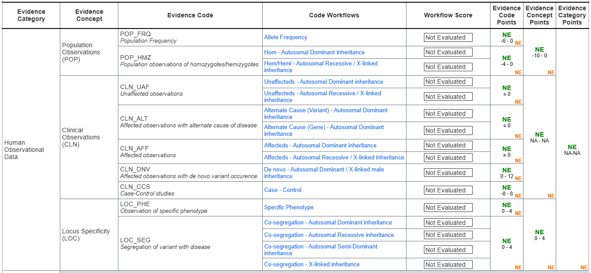

# Human Observational Data

**Human Observational Data (HOD)** is one of the two top-level Evidence
Categories in the SVCv4 Summary Table. It covers evidence observed in
populations and patients.

{ loading=lazy }

*The Human Observational Data section of the SVCv4 Summary Table, with its code
workflows. (Figure provided by the SVCv4 Standards group.)*

## Concepts and codes

| Concept | Codes | What it captures |
|---|---|---|
| **Population (POP)** | `POP_FRQ`, `POP_HMZ` | Allele frequency; observations of homozygotes/hemizygotes. |
| **Clinical Observations (CLN)** | `CLN_UAF`, `CLN_ALT`, `CLN_AFF`, `CLN_DNV`, `CLN_CCS` | Observations in (un)affected individuals, alternate-cause cases, de novo occurrences, and case-control studies. |
| **Locus Specificity (LOC)** | `LOC_PHE`, `LOC_SEG` | Observation of a specific phenotype; segregation of the variant with disease. |

<!-- VERIFY: concept/code roster transcribed from the "Human Observational Data w/ Workflows" Summary Table graphic; confirm with the SVCv4 WG. -->

## Where this model goes deep

The **[Clinical Observations (CLN)](cln/index.md)** workflows are detailed here
and backed by the [Case model](../case-model.md). **[Population (POP)](pop.md)**
and **[Locus Specificity (LOC)](loc.md)** are summarized for now and will be
modeled in a later phase.

Scoring rules for every code live in [ClinGen CSpec](../../reference/cspec-interop.md).
