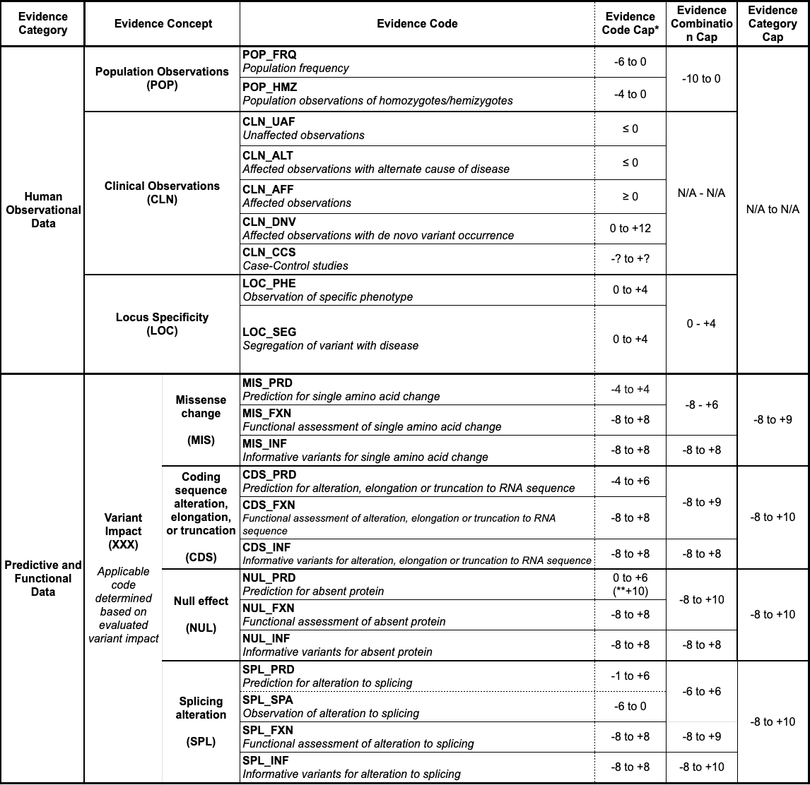

# Workflows overview

SVCv4 organizes evidence in the **Summary Table** — a top-down hierarchy that the
SVCv4 Working Group defines and that this model mirrors:

**Evidence Category → Evidence Concept → Evidence Code → Code Workflow(s) → Workflow Score**

Scores roll up each level. A **workflow** is the procedure for evaluating the
evidence captured under an Evidence Code; in the model, each workflow's result
surfaces as an [Evidence Line](../getting-started/evidence-lines-and-items.md).

{ loading=lazy }

*The SVCv4 Summary Table. (Figure provided by the SVCv4 Standards group.)*

## The two categories

- **[Human Observational Data](human-observational-data.md)** — evidence from
  populations and patients: Population (POP), Clinical Observations (CLN), and
  Locus Specificity (LOC).
- **[Variant Impact](variant-impact.md)** — predictive and functional evidence
  about the variant's molecular effect: Single-amino-acid change (MIS), RNA
  alteration (CDS), Absent protein (NUL), and Splicing (SPL).

## What this section covers now

This model currently details the **Clinical Observations (CLN)** workflows that
the [Case model](case-model.md) supports — Affected, De Novo, Alternative
Variant, Alternative Gene, and Unaffected. The other concepts are summarized at
the category level and will be detailed as the model grows.

!!! note "Scoring lives in CSpec"

    These pages describe **what evidence each workflow needs** (the Evidence
    Items to capture). The scoring **rules** that turn that evidence into points
    are defined and applied in [ClinGen CSpec](../reference/cspec-interop.md), not
    in this model.
