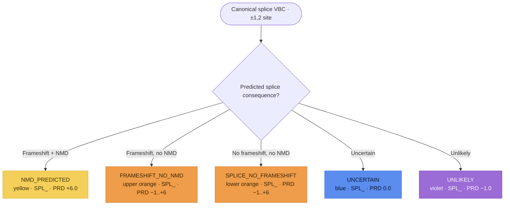

# Canonical Splice variants (`SPL_`)

**Canonical splice variants** alter the essential `GT` donor (`+1`/`+2`) or `AG`
acceptor (`−2`/`−1`) dinucleotides. SVCv4 (Supplementary Material 11) routes each
VBC down **one** of five color paths — the *same five* the
[Missense](missense.md) splice half uses — all resolving to the **`SPL_`** parent
code via the shared pipeline: **SPL_PRD** (prediction) → **SPL_SPA** (splice assay)
→ **SPL_FXN** (functional, SM 20) → **SPL_INF** (informative, SM 19) → the capped
`SPL_` total. Modeled as one `CanonicalSpliceAssessment` (`prediction_outcome` =
`SplicePredictionOutcome`); each step is **documented, not computed**.

!!! note "Modeled here — inputs captured"

    `CanonicalSpliceAssessment` reuses the shared splice vocabulary
    (`SplicePredictionOutcome`, `SplicePredictiveEvidence`, `SpliceAssayEvidence`) —
    the same types the missense splice half uses. Only the point values and the
    splice-assay direction differ (documented below), so the *structure* is shared.

## Decision tree

The path is selected by the predicted splice consequence of the canonical (±1,2) variant.
Each terminal node is tinted its SM 11 color-path. (Diagram derived from the flow logic;
not the source figure.)

## Branches

| Path (`prediction_outcome`) | Splice prediction | SPL_PRD initial | SPL_ total |
|---|---|---|---|
| `NMD_PREDICTED` (yellow) | frameshift + NMD | `+6.0` | `−8.0 to +10.0` |
| `FRAMESHIFT_NO_NMD` (upper orange) | frameshift, no NMD | `−1.0 to +6.0` | `−8.0 to +10.0` |
| `SPLICE_NO_FRAMESHIFT` (lower orange) | no frameshift, no NMD | `−1.0 to +6.0` | `−8.0 to +10.0` |
| `UNCERTAIN` (blue) | uncertain | `0.0` | `−8.0 to +8.0` |
| `UNLIKELY` (violet) | unlikely | `−1.0` | `−8.0 to 0.0` |

### Predictive (`SPL_PRD_`)

Positive initial points (yellow/orange) are reduced by the
[Molecular Mechanism & Exon Relevance](index.md#molecular-mechanism-exon-relevance-modeled-inputs)
matrix (SM 18); blue and violet skip it. The yellow branch awards a fixed **+6.0**
for a predicted NMD event (note: the missense splice half awards +3.0 here — the
canonical prior is higher). The orange branches read `−1.0 to +6.0` from a
critical-amino-acid table (the lower-orange path may fold in a protein-deletion
in-silico tool, `+0.5` / `−0.5`).

### Splice assay (`SPL_SPA_`)

`SpliceAssayEvidence` captures RNA / minigene / RT-PCR evidence. Its semantics
differ by path — and, for yellow/orange, differ from the missense splice half: here
the assay **reduces** the SPL_PRD evidence (near-complete → 0; substantial → −25%;
incomplete/none → −100% of SPL_PRD), rather than scaling it up. For blue it is
**additive** (`−2.0 to +2.0`); for violet it adds **benignity** (`−2.0 to 0.0`,
with the held PRD+SPA capped `−3.0 to 0.0`). Canonical splice permits patient-sample
splice data on the yellow/orange paths (unlike blue/violet) because of the high
prior that a canonical variant disrupts splicing.

### Functional (`SPL_FXN_`) and informative (`SPL_INF_`)

`SPL_FXN` reuses the generic [Functional Assays](index.md#functional-assays-modeled-inputs)
module (`FunctionalAssayEvidence`), coded `−8.0 to +8.0` (capped `−8.0 to 0.0` on the
violet path). `SPL_INF` reuses the generic
[Informative Variants](index.md#informative-variants-modeled-inputs) module
(`InformativeVariantsEvidence`, SM 19): +2.0 first P / +1.0 first LP / +1.0 each
additional (negatives for B/LB), coded `−8.0 to +8.0` — the **violet path restricts
it to B/LB only**. P/LP informative variants must have the same predicted event and a
VBC prediction of similar-or-higher strength.

### Held combined values and the `SPL_` total

Per SM 11, the model records **both** the separate coded values and the two held
combined values (`prd_spa_combined` = SPL_PRD + SPL_SPA; `prd_spa_fxn_combined` =
SPL_PRD + SPL_SPA + SPL_FXN), then the capped parent `SPL_` total (`spl_total`),
whose range depends on the path (table above). **Gain-of-function** splice effects
are out of scope in SM 11.
