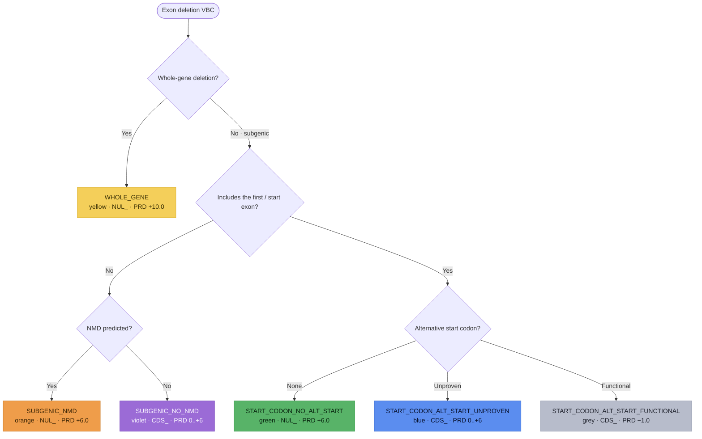

# Single/Multi-Exon Deletion variants (`NUL_` / `CDS_`)

**Single- or multi-exon deletions** range from a single exon up to an entire single
gene (the sequence ontology calls these "transcript ablation"). SVCv4 (Supplementary
Material 13) routes each VBC down **one** of six branches, selected by a decision
tree — whole-gene? / includes the first coding (start) exon? / NMD predicted? /
alternative in-frame start codon and its functionality. Each branch resolves to a
parent code — `NUL_` or `CDS_` — via the same pipeline: **PRD** (predictive) →
**FXN** (functional, SM 20) → **INF** (informative, SM 19) → the capped parent total.
Modeled as one `ExonDeletionAssessment`
(`prediction_outcome` = `ExonDeletionOutcome`); each step is **documented, not
computed**.

!!! note "Modeled here — inputs captured"

    Both models (`ExonDeletionAssessment`, `ExonDeletionPredictiveEvidence`) capture
    the analyst's inputs; the scoring is documented, not computed.

## Decision tree

The branch is selected by whether the deletion removes the whole gene, includes the first
(start) exon, triggers NMD, and — for the start-exon paths — the status of an alternative
start codon. Each terminal node is tinted its SM 13 color-path. (Diagram derived from the
flow logic; not the source figure.)

## Branches

| Branch (`prediction_outcome`) | Condition | Parent code | PRD initial | Parent total |
|---|---|---|---|---|
| `WHOLE_GENE` (yellow) | whole-gene deletion | `NUL_` | `+10.0` | `−8.0 to +10.0` |
| `SUBGENIC_NMD` (orange) | subgenic, not first exon, NMD | `NUL_` | `+6.0` | `−8.0 to +10.0` |
| `SUBGENIC_NO_NMD` (violet) | subgenic, not first exon, no NMD | `CDS_` | `0.0 to +6.0` | `−8.0 to +10.0` |
| `START_CODON_NO_ALT_START` (green) | includes start exon, no alt-start | `NUL_` | `+6.0` | `−8.0 to +10.0` |
| `START_CODON_ALT_START_UNPROVEN` (blue) | includes start, unproven alt-start | `CDS_` | `0.0 to +6.0` | `−8.0 to +10.0` |
| `START_CODON_ALT_START_FUNCTIONAL` (grey) | includes start, functional alt-start | `CDS_` | `−1.0` | `−8.0 to 0.0` |

The parent code reuses `PfdParentCode` (`NUL` / `CDS`).

## Predictive (`*_PRD_`)

The **whole-gene (yellow)** branch awards a fixed **+10.0**, then applies the SM 18
matrix **mechanism-only** — the exon-relevance axis is *removed* because the VBC is
the entire gene. The **NMD (orange)** and **start-exon-no-alt (green)** branches
award a fixed **+6.0**, then the full SM 18 matrix. The **no-NMD (violet)** and
**unproven-alt-start (blue)** branches read `0.0 to +6.0` from a table keyed on the
fraction of protein removed (`protein_fraction_removed`) or critical-domain loss —
violet applies the criteria strictly in order, blue may take the highest applicable —
then the SM 18 matrix. The **functional-alt-start (grey)** branch awards a fixed
**−1.0** (the alternative start yields normal function, `alternative_start_functional`)
and **skips** the SM 18 matrix.

## Functional (`*_FXN_`) and informative (`*_INF_`)

`FXN` reuses the generic [Functional Assays](index.md#functional-assays-modeled-inputs)
module (`FunctionalAssayEvidence`), coded `−8.0 to +8.0` — **capped `−8.0 to 0.0`
(benignity-only) on the grey path**. `INF` reuses the generic
[Informative Variants](index.md#informative-variants-modeled-inputs) module
(`InformativeVariantsEvidence`, SM 19): a variant deleting a similarly altered/removed
region (or, for the NMD paths, a same-exon PTC) — +2.0 first P / +1.0 first LP / +1.0
each additional (negatives for B/LB), VUS → 0.0, coded `−8.0 to +8.0` — **grey INF is
benignity-only (`−8.0 to 0.0`)**. For whole-gene, subgenic P/LP deletions count for
pathogenicity but subgenic B/LB deletions do not count for benignity.

## Held combined value and the parent total

Per SM 13, the model records **both** the separate coded values and the one held
`PRD + FXN` combined value (`prd_fxn_combined`, no distinct code) — capped `−8.0 to
+10.0` (the `NUL_` paths), `−8.0 to +9.0` (violet / blue), or `−8.0 to 0.0` (grey).
The parent total (`parent_total`) is coded `NUL_ −8.0 to +10.0` (yellow / orange /
green), `CDS_ −8.0 to +10.0` (violet / blue), or `CDS_ −8.0 to 0.0` (grey).

*(SM 13 has a source typo: the whole-gene no-functional-data code reads `SPL_FXN_ND`;
the correct code is `NUL_FXN_ND`.)*

## Out of scope

Three situations are handled elsewhere and are **not modeled** here: multi-gene
deletions (→ the CNV recommendations), deletions smaller than an exon (→
[In-Frame InDel](inframe-indel.md) SM 10 / [Frameshift](frameshift.md) SM 9), and
deletions flanking a single exon-intron boundary (→ [Canonical Splice](canonical-splice.md)
SM 11). Gain-of-function effects are not addressed.
