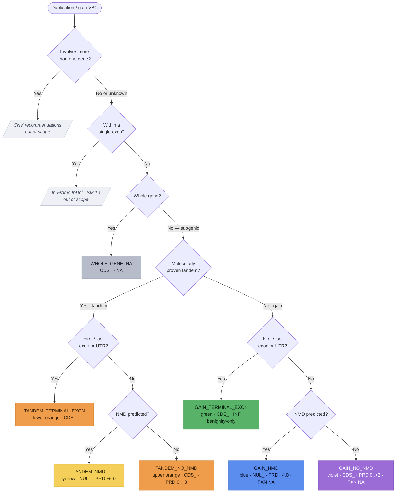

# Single/Multi-Exon Duplication/Gain variants (`NUL_` / `CDS_`)

**Single- or multi-exon duplication/gain variants** begin and end within a single gene
(the sequence ontology calls these "transcript amplification"). SVCv4 (Supplementary
Material 14) carries a decision axis the other LoF workflows do not: whether the variant
is **molecularly proven to be a tandem duplication** ("duplication") or is an **unproven
copy-number gain** ("gain"). Only ~80% of subgenic gains are actually tandem, which sits
in the VUS-High posterior range — so gains accrue fewer points than proven tandem
duplications. Each group then splits on NMD-predicted and on whether a terminal (first or
last) exon/UTR is included, routing the VBC to a `NUL_` or `CDS_` parent code through the
shared pipeline: **PRD** (predictive) → **FXN** (functional, SM 20; not considered on the
gain paths) → **INF** (informative, SM 19) → the capped parent total. Modeled as one
`ExonDuplicationAssessment` (`prediction_outcome` = `ExonDuplicationOutcome`); each step is
**documented, not computed**.

!!! note "Modeled here — inputs captured"

    Both models (`ExonDuplicationAssessment`, `ExonDuplicationPredictiveEvidence`) capture
    the analyst's inputs; the scoring is documented, not computed.

## Decision tree

The branch is selected by a decision tree over three axes — molecularly proven tandem vs
an unproven gain, whether a terminal (first/last) exon/UTR is included, and NMD-predicted.
Each terminal node is tinted its SM 14 color-path. (Diagram derived from the SM 14 flow
logic; not the source figure.)

## Branches

| Branch (`prediction_outcome`) | Tandem? | Parent | PRD initial | FXN | Parent total |
|---|---|---|---|---|---|
| `TANDEM_NMD` (yellow) | proven | `NUL_` | `+6.0` | SM 20 | `−8.0 to +10.0` |
| `TANDEM_NO_NMD` (upper orange) | proven | `CDS_` | `0.0 to +3.0` | SM 20 | `−8.0 to +10.0` |
| `TANDEM_TERMINAL_EXON` (lower orange) | proven | `CDS_` | `0.0` (no SM 18) | SM 20 | `−8.0 to +10.0` |
| `GAIN_NMD` (blue) | not proven | `NUL_` | `+4.0` | `NA` | `−1.0 to +6.0` |
| `GAIN_NO_NMD` (violet) | not proven | `CDS_` | `0.0 to +2.0` | `NA` | `−1.0 to +6.0` |
| `GAIN_TERMINAL_EXON` (green) | not proven | `CDS_` | `0.0` (no SM 18) | `NA` | `−8.0 to 0.0` |
| `WHOLE_GENE_NA` | — | `CDS_` | `NA` | `NA` | `NA` |

The parent code reuses `PfdParentCode` (`NUL` / `CDS`). The `molecularly_tandem`,
`nmd_predicted`, and `includes_terminal_exon_or_utr` predictive fields record the three
decision-tree axes that select the branch.

## Predictive (`*_PRD_`)

**Tandem-proven, subgenic, no terminal exon:** the **yellow** branch (NMD predicted)
awards a fixed **+6.0**; the **upper-orange** branch (no NMD → in-frame elongated protein)
reads **0.0 to +3.0** from the fraction of ORF duplicated (>50% → `+3.0`; <10% → `0.0`) or,
alternatively, the criticality of the duplicated amino acids (an entire proven
disease-relevant domain → `+3.0`). Both then apply the SM 18 mechanism/exon matrix.

**Not-tandem "gain", subgenic, no terminal exon:** the **blue** branch (NMD predicted)
awards a fixed **+4.0** — lower than the tandem `+6.0` for the ~80% tandem uncertainty; the
**violet** branch (no NMD) reads **0.0 to +2.0** from predicted protein disruption (>50% or
an entire experimentally-implicated critical domain → `+2.0`; <10% or unknown role → `0.0`;
low analyst confidence → `0.0`). Both then apply the SM 18 matrix.

**Terminal-exon branches (lower orange, green):** a duplication that includes the first
exon, last exon, or either UTR is unlikely to be LoF, so **no initial points** are awarded
and the SM 18 matrix is **not applicable**. (Per SM 14, the tandem lower-orange path follows
the green-path predictive logic.)

**Whole-gene duplication:** awarded `CDS_PRD_NA` — few genes have documented
triplosensitivity (see [Out of scope](#out-of-scope)).

## Functional (`*_FXN_`) and informative (`*_INF_`)

On the **tandem** paths (yellow, upper orange, lower orange) `FXN` reuses the generic
[Functional Assays](index.md#functional-assays-modeled-inputs) module
(`FunctionalAssayEvidence`, `−8.0 to +8.0`) — the assay must confirm the *predicted*
consequence (transcript/protein loss for NMD; protein elongation for the in-frame paths),
not a truncated-protein effect. On the **gain** paths (blue, violet, green) functional data
are **not considered** — coded `*_FXN_NA` — because these genomic consequences are unique
per occurrence and rarely assayed.

`INF` reuses the generic [Informative Variants](index.md#informative-variants-modeled-inputs)
module (`InformativeVariantsEvidence`, SM 19): variants duplicating a similar region
(breakpoints need not match). For pathogenicity a P/LP informative variant's effect should
be same-or-less-damaging than the VBC (and ≤ VBC ORF size); for benignity a B/LB variant's
effect should be same-or-more-damaging — +2.0 first P / +1.0 first LP / +1.0 each additional
distinct variant. The tandem paths code `INF −8.0 to +8.0`; the blue/violet gain paths code
`INF −8.0 to +6.0`. The **green** path is **benignity-only**: `−2.0` first B / `−1.0` first
LB / `−1.0` each additional — and if any P/LP informative variant exists, the analyst should
reconsider whether the green path is correct.

## Held combined value and the parent total

On the two tandem branches that award functional points, the model records **both** the
separate coded values and the one held `PRD + FXN` combined value (`prd_fxn_combined`, no
distinct code) — capped `−8.0 to +10.0` (yellow `NUL_`) or `−8.0 to +9.0` (upper-orange
`CDS_`). The lower-orange path merges its functional and informative steps with the
upper-orange path, and its parent follows the upper-orange coding (`CDS_ −8.0 to +10.0`).

The parent total (`parent_total`) is coded `NUL_ −8.0 to +10.0` (yellow), `CDS_ −8.0 to
+10.0` (upper/lower orange), `NUL_ −1.0 to +6.0` (blue), `CDS_ −1.0 to +6.0` (violet), or
`CDS_ −8.0 to 0.0` (green). The whole-gene NA outcome is coded `CDS_NA` (with `CDS_PRD_NA`,
`CDS_FXN_NA`, `CDS_INF_NA`) to document that the recommendations were evaluated and found
not applicable.

## Out of scope

Three situations are handled elsewhere and are **not** scored here: **multi-gene
duplications** (→ the CNV recommendations, PMID 31690835), **duplications beginning and
ending within a single exon** (→ [In-Frame InDel](inframe-indel.md) SM 10), and **whole-gene
duplications** (recorded as `WHOLE_GENE_NA`; few genes have curated triplosensitivity, so
classification is deferred to the CNV recommendations / expert judgment). Gain-of-function
effects are not addressed. Analytic validity matters: laboratories should calibrate their
platform's positive predictive value for detecting a gain and adjust the recommended points
downward (toward 0.0) when PPV is low or orthogonal confirmation is absent.
