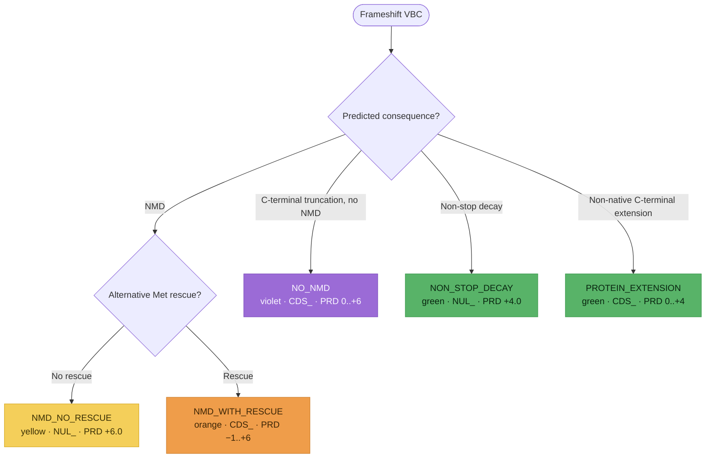

# Frameshift variants (`NUL_` / `CDS_`)

**Frameshift variants** shift the reading frame, typically introducing a premature
termination codon (PTC) — or, less often, reading through the normal stop. SVCv4
(Supplementary Material 9) routes each VBC down **one** of five branches, selected
by the predicted consequence. Each branch resolves to a parent code — `NUL_` or
`CDS_` — via the same pipeline: **PRD** (predictive) → **FXN** (functional, SM 20)
→ **INF** (informative, SM 19) → the capped parent total. Modeled as one
`FrameshiftAssessment` (`prediction_outcome` = `FrameshiftPredictionOutcome`); each
step is **documented, not computed**.

!!! note "Modeled here — inputs captured"

    Both models (`FrameshiftAssessment`, `FrameshiftPredictiveEvidence`) capture the
    analyst's inputs; the scoring is documented, not computed.

## Decision tree

The branch is selected by the predicted consequence of the frameshift (and, for NMD, whether
an alternative Met rescues translation). The two green branches (non-stop decay / protein
extension) are alternatives the analyst weighs against the violet path, taking the more
pathogenic — not additive. Each terminal node is tinted its SM 9 color-path. (Diagram
derived from the flow logic; not the source figure.)

## Branches

| Branch (`prediction_outcome`) | Predicted consequence | Parent code | PRD initial | Parent total |
|---|---|---|---|---|
| `NMD_NO_RESCUE` (yellow) | NMD, no rescue | `NUL_` | `+6.0` | `−8.0 to +10.0` |
| `NMD_WITH_RESCUE` (orange) | NMD, alt-Met rescue | `CDS_` | `−1.0 to +6.0` | `−8.0 to +10.0` |
| `NO_NMD` (violet) | C-terminal truncation, no NMD | `CDS_` | `0.0 to +6.0` | `−8.0 to +10.0` |
| `NON_STOP_DECAY` (green) | non-stop decay (NSD) | `NUL_` | `+4.0` | `−8.0 to +10.0` |
| `PROTEIN_EXTENSION` (green) | non-native C-terminal extension | `CDS_` | `0.0 to +4.0` | `−8.0 to +10.0` |

The parent code reuses `PfdParentCode` (`NUL` / `CDS`) and **follows from**
`prediction_outcome` (yellow / NSD → `NUL`; orange / violet / extension → `CDS`) —
`parent_code` records that resolved code and should be kept consistent with the
branch.

## Predictive (`*_PRD_`)

The **yellow** branch awards a fixed **+6.0** (predicted NMD); the **green NSD**
branch a fixed **+4.0** (the ORF runs to the polyA site with no in-frame stop —
`non_stop_decay_predicted`). The **orange** and **violet** branches read initial
points from a table keyed on the **fraction of protein lost**
(`protein_fraction_reduced`) — with, as an alternative axis, the **criticality of
the deleted amino acids**, which leans on Critical Amino Acids and is **deferred**
(see the cross-reference note below). The **green extension** branch reads `0.0 to
+4.0` from an extension table (experimentally-deleterious C-terminal addition →
+4.0; some data + ≥30 aa → +3.0; some evidence or ≥30 aa → +2.0; else 0.0), keyed
partly on `extension_length_aa`. The `alternative_met_rescue` flag records the
rescue-codon evidence for the orange branch. Positive initial points are then
reduced by the
[Molecular Mechanism & Exon Relevance](index.md#molecular-mechanism-exon-relevance-modeled-inputs)
matrix (SM 18); the result is coded `*_PRD_` per the branch's range above.

!!! note "The two green branches are a non-additive choice"

    SM 9 instructs that the green (NSD / extension) branches be **compared** against
    the NMD-not-predicted (violet) path and the **more pathogenic** result applied.
    The two are **not additive** — the analyst selects a single
    `prediction_outcome`; the comparison is documented, not computed.

## Functional (`*_FXN_`) and informative (`*_INF_`)

`FXN` reuses the generic [Functional Assays](index.md#functional-assays-modeled-inputs)
module (`FunctionalAssayEvidence`), coded `−8.0 to +8.0` — for the yellow and NSD
branches the functional data must confirm **loss of transcript/protein**, not a
truncated/elongated-protein effect. `INF` reuses the generic
[Informative Variants](index.md#informative-variants-modeled-inputs) module
(`InformativeVariantsEvidence`, SM 19): +2.0 first P / +1.0 first LP / +1.0 each
additional (negatives for B/LB), coded `−8.0 to +8.0`. (SM 9's text in the
violet-branch `CDS_INF_` step has a source typo reading `IMP_INF_+8.0`; the correct
upper bound is `CDS_INF_+8.0` — all INF caps are `−8.0 to +8.0`.) The **position**
eligibility differs per branch: same-exon-as-PTC same-NMD (yellow); a P/LP PTC
between the VBC and the alternate start (orange); a PTC downstream of the VBC but
upstream of the normal stop (violet); a termination codon downstream of the polyA
(NSD); the same elongation impact (extension) — a documented eligibility rule, not
separate fields.

## Held combined value and the parent total

Per SM 9, the model records **both** the separate coded values and the one held
`PRD + FXN` combined value (`prd_fxn_combined`, no distinct code). Note the held cap
is **`+10.0` for yellow** but **`+9.0` for the other four branches**, even though
all five *parent* totals cap at `+10.0`. The parent total (`parent_total`) is coded
`NUL_ −8.0 to +10.0` (yellow / NSD) or `CDS_ −8.0 to +10.0` (orange / violet /
extension).

**Gain-of-function** effects (truncated, deleted, or extended proteins when NMD is
not induced) are explicitly out of scope in SM 9 and are not modeled here.

!!! note "SM 7 cross-reference"

    The critical-domain criticality axis (an alternative to the protein-fraction
    table for the orange/violet branches) leans on
    [Determining Critical Amino Acids (SM 7)](../../reference/spec-alignment.md) and
    is deferred to that increment.
