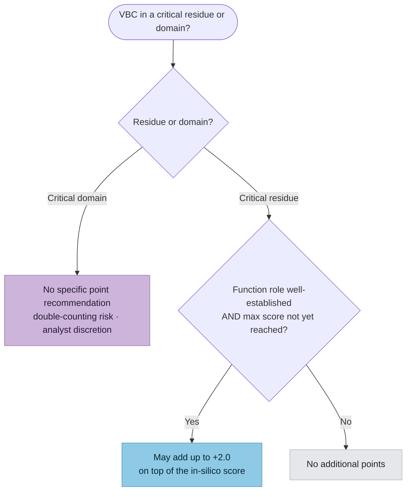

# Predictive & Functional Data (PFD)

**Predictive & Functional Data (PFD)** is the second top-level Evidence Category
in the SVCv4 Summary Table (alongside
[Human Observational Data](../hod/index.md)) — labeled **Variant Impact** in the
Summary Table. It covers **predictive and functional** evidence about the
variant's molecular effect. The applicable code is determined by the variant's
evaluated impact (e.g. missense, nonsense, splice, indel).

{ loading=lazy }

*The Variant Impact (Predictive & Functional Data) section of the SVCv4 Summary
Table, with its code workflows. (Figure provided by the SVCv4 Standards group.)*

!!! note "Modeling landed — submodules, scaffold, and all ten workflows"

    The **four shared PFD submodules** — Determining Critical Amino Acids (SM 7),
    Molecular Mechanism & Exon Relevance (SM 18), Informative Variants (SM 19),
    Functional Assays (SM 20) — the **variant-agnostic scaffold** (`PfdCodeAssessment`)
    that composes them, and **all ten released per-variant-type workflows** are now
    modeled (inputs captured, scoring documented not computed); see
    [below](#the-shape-of-the-remaining-work). What remains is the cross-cutting scoring
    computation. This page summarizes the concepts and tracks what has landed.

## Concepts and codes

Each concept uses a common code pattern: **`_PRD`** (prediction), **`_FXN`**
(functional assessment), **`_INF`** (informative variants), plus **`_SPA`**
(splice assay) for splicing.

| Concept | Codes |
|---|---|
| **Single amino-acid change (MIS)** | `MIS_PRD`, `MIS_FXN`, `MIS_INF` |
| **Alteration/elongation/truncation to RNA (CDS)** | `CDS_PRD`, `CDS_FXN`, `CDS_INF` |
| **Absent protein (NUL)** | `NUL_PRD`, `NUL_FXN`, `NUL_INF` |
| **Alteration to splicing (SPL)** | `SPL_PRD`, `SPL_SPA`, `SPL_FXN`, `SPL_INF` |

Scoring for these codes is defined in
[ClinGen CSpec](../../reference/cspec-interop.md).

## The shape of the remaining work

Every PFD workflow (missense, nonsense, frameshift, canonical splice, exon
deletion, start loss, stop loss, and others) follows the same pipeline:
**predict → adjust for molecular mechanism / exon relevance → functional
evidence → informative variants → capped code total.** Four sub-modules are
shared across all of them: Determining Critical Amino Acids, Molecular
Mechanism and Exon Relevance, Informative Variants, and Functional Assays.
All four are now modeled (inputs), so the variant-type workflows can
compose them.

### Molecular Mechanism & Exon Relevance ✅ modeled (inputs)

The first shared sub-module is modeled as `MechanismExonRelevanceEvidence`
([Supplementary Material 18](https://docs.google.com/document/d/1BLnsgxLY0TibwylFWz0SeGGeCusWwSokrgU4qsmBiaw/edit)).
It captures the two axes of the SM 18 multiplier — the GenCC **mechanism** level
and the **exon relevance** category — plus the assessed transcript's MANE status
and two override flags (a known-irrelevant exon; an exon with established
pathogenic variants). The multiplier itself is **documented here, not computed**:

| GenCC mechanism | × | | Exon relevance | × |
|---|---|---|---|---|
| Established | 1.0 | | All | 1.0 |
| Likely | 0.5 | | Most | 0.5 |
| Suspected | 0.25 | | Few | 0 |
| Uncertain | 0 | | | |

It scales positive predictive (PRD) points by *mechanism fraction × exon-relevance
fraction* (the two reductions are **not** compounded). The mechanism axis is gated
on gene-disease validity: it applies only for MDEs at **Moderate+**
`WorkflowParameters.gene_disease_validity` — Limited-or-below is treated as
`UNCERTAIN` (→ ×0). See [Core concepts](../../reference/concepts.md) for that gate.

### Informative Variants ✅ modeled (inputs)

The second shared sub-module is modeled as `InformativeVariantsEvidence` — a list
of `InformativeVariant`
([Supplementary Material 19](https://docs.google.com/document/d/1hNfdtdvDT4dob9oDBrL_UzVV_MYiWnwERfli76EAbyQ/edit)).
An informative variant is a variant **other than the VBC** that informs its
classification. Each captures the variant `id`, its `classification`
(P/LP/VUS/LB/B), the `similarity_basis` (similar position / same exon / similar
effect / gene deletion), and the eligibility gates: `distinct_evidence_from_vbc`
(it must have reached its classification via *different* evidence codes than the
VBC to count), and — for external classifications — `star_rating` (usable only at
3–4 stars) and `circularity_checked` (the VBC was not used as evidence for it).

The scoring is **documented, not computed**: **+2.0** for the first distinct
Pathogenic informative variant and **+1.0** each additional distinct P; **+1.0**
each for LP-only. **Only distinct variants count** — a single observation counts
the same as ten. This evidence has its own cap of **−8 to +8**; the negative
(Benign / Likely-Benign) side is *inferred from that cap* rather than spelled out
in SM 19. Unlike the other pipeline steps, informative-variant points are **not**
reduced by the [Molecular Mechanism & Exon Relevance](#molecular-mechanism-exon-relevance-modeled-inputs)
matrix.

### Functional Assays ✅ modeled (inputs)

The third shared sub-module is modeled as `FunctionalAssayEvidence`
([Supplementary Material 20](https://docs.google.com/document/d/1X68otBl4YvdXlP1bOD83JO4kIod0Ol5BoLB4CLxqijA/edit)),
holding two lists plus a shared `disease_mechanism`
(`MolecularMechanism`):

- **`protein_assays`** (`ProteinFunctionalAssay`) — `assay_type`, `odds_path`,
  `has_pathogenic_controls` / `has_benign_controls` (+ counts),
  `has_false_positives_or_negatives`, `fidelity_to_mechanism`.
- **`animal_models`** (`AnimalModelEvidence`) — `model_type`, `species`,
  `ortholog_established`, `phenotype_replication`, `inheritance_match`,
  `local_sequence_similarity_high`, `fidelity_to_mechanism`.

The scoring is **documented, not computed**. Protein/cellular assays are
calibrated by an **OddsPath** (likelihood ratio) that **requires both pathogenic
and benign variant controls**; small experiments with no false positives/
negatives read points from lookup Tables 1/2, while experiments with FP/FN,
trichotomized data, or MAVE need expert calibration (out of scope). Animal-model
evidence ranges **`_FXN_0.0` to `+4.0`** per Table 3, weighted by phenotype
replication, inheritance match, and local sequence similarity.

Two gates apply: an assay that does **not** faithfully recapitulate the disease
molecular mechanism scores `FXN_0.0`; and multiple assays combine by rule (same
readout + same direction → strongest only; opposite directions → sum; distinct
functions → the most disease-relevant). Functional (`*_FXN`) points **add to**
predictive (`*_PRD`) points. **Carve-out:** RNA splicing assays (RT-PCR / RNAseq
/ minigene) are **not** `*_FXN` — they are `SPL_SPA`, handled in the splice flow
diagrams (SM 6/11/12), and are not modeled here.

### Determining Critical Amino Acids ✅ modeled (inputs)

The fourth shared sub-module is modeled as `CriticalAminoAcidEvidence`
([Supplementary Material 7](https://docs.google.com/document/d/1a64UTev9P35YGStF7YjaprB8znWS5OC5qbBZBMMLA_s/edit)).
It captures an analyst's determination that a VBC lies in a critical residue or domain (a
`CriticalityKind`), the named motif/domain, the small additional evidence that may be added
on top of the in-silico predictor, and the SM 7 gating conditions. It has **no parent code**
of its own — the points add to whichever `_PRD_` applies (most commonly `MIS_PRD_`).

The scoring is **documented, not computed**. For **critical domains**, SM 7 makes no
specific point recommendation — v4 substantially strengthened the in-silico predictors
(which already capture much of v3's PM1 "critical domain" evidence), so adding domain points
risks *double-counting* (`double_counting_considered` records that the analyst checked this).
Not every conserved domain is critical: immunoglobulin-like domains generally do not qualify,
and a duplicated domain (e.g. the BRCA1 BRCT motif) may tolerate disruption of one copy. For
**critical residues** (e.g. the Gly-X-Y motif glycine in triple-helical collagens; Cys-Cys
bridge cysteines in FBN1/NOTCH3; the cys/his of a C2H2 zinc finger in GLI3 — SM 7 prints
"C2H4", an apparent typo), an analyst may add **up to +2.0 points**, but **only if** the
residue's functional role is well-established (`function_role_established`) **and** the
`_PRD_` + `_INF_` combination has not already reached its cap (`max_score_not_reached`). A
caution applies throughout: avoid using this to reach **+6.0 on prediction alone**,
especially for a variant never observed in an affected individual (`observed_in_affected`).

### PFD scaffold ✅ modeled (inputs)

The shared, variant-agnostic scaffold is modeled as `PfdCodeAssessment`. It ties
one **parent code**'s pipeline together: a `predictive` (`_PRD`) step
(`PfdPredictiveEvidence`), the three embedded shared submodules
(`mechanism_exon_relevance` / `functional` / `informative`, SM 18/19/20), the
coded sub-code point values (`prd_points` / `spa_points` / `fxn_points` /
`inf_points`), and the capped `parent_total`. The `parent_code` is one of
`NUL` / `CDS` / `SPL` / `MIS` (plus `NCG` / `REG`) — `PfdParentCode`.

The pipeline is **documented here, not computed**: `_PRD` (in-silico prediction)
→ adjusted by the [Molecular Mechanism & Exon Relevance](#molecular-mechanism-exon-relevance-modeled-inputs)
matrix (SM 18) → for splice paths, an `_SPA` (splice-assay) step → `_FXN`
(functional) → `_INF` (informative) → the capped parent-code total. Each sub-code
and intermediate has its own cap (SM 6 gives `MIS_` −8.0 to +9.0 and `SPL_` −8.0
to +10.0). Following SM 6, the model records **both** the separate coded sub-code
values and the parent total; the *combined-held* intermediates (e.g. PRD+FXN,
which has no distinct evidence code) and the `_ND` (No Data) coding for an absent
step are captured through the same optional fields. The typed predictor/path
enums and the dual missense **MIS_ / SPL_** path (evaluate both, apply the
higher) arrive with the per-variant-type workflows.

**The four shared sub-modules and the scaffold are now modeled** (inputs). Ten
per-variant-type workflows are modeled: the full [Missense](missense.md) workflow
(the `MIS_` amino-acid path, the `SPL_` splice paths, and the `MIS_`-vs-`SPL_`
comparison), the [Nonsense](nonsense.md) workflow (`NUL_`/`CDS_`, three branches),
the [Frameshift](frameshift.md) workflow (`NUL_`/`CDS_`, five branches), the
[In-Frame InDel](inframe-indel.md) workflow (`CDS_`, two branches), the
[Canonical Splice](canonical-splice.md) workflow (`SPL_`, five color paths), the
[Intronic & Synonymous](intronic-synonymous.md) workflow (`SPL_`, five splice paths),
the [Exon Deletion](exon-deletion.md) workflow (`NUL_`/`CDS_`, six branches), and the
[Exon Duplication](exon-duplication.md) workflow (`NUL_`/`CDS_`, six scored branches plus
a whole-gene NA outcome), the [Start-Lost](start-lost.md) workflow (`NUL_`/`CDS_`, three
branches), and the [Stop-Lost](stop-lost.md) workflow (`NUL_`/`CDS_`, two branches). This
completes every variant-type workflow the Working Group has released (Non-Coding, SM 17, is
not yet released); the cross-cutting scoring computation is still to come.
