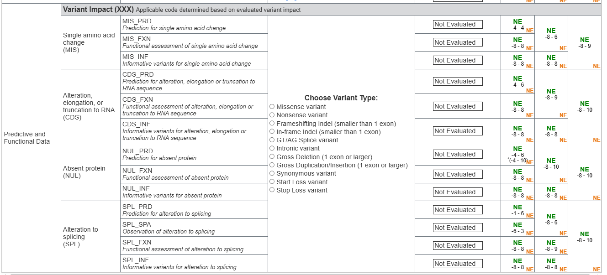

# Predictive & Functional Data (PFD)

**Predictive & Functional Data (PFD)** is the second top-level Evidence Category
in the SVCv4 Summary Table (alongside
[Human Observational Data](../hod/index.md)) — labeled **Variant Impact** in the
Summary Table. It covers **predictive and functional** evidence about the
variant's molecular effect. The applicable code is determined by the variant's
evaluated impact (e.g. missense, nonsense, splice, indel).

{ loading=lazy }

*The Variant Impact (Predictive & Functional Data) section of the SVCv4 Summary
Table, with its code workflows. (Figure provided by the SVCv4 Standards group.)*

!!! note "Modeling underway — first submodule landed"

    The **first PFD submodule — Molecular Mechanism & Exon Relevance
    (Supplementary Material 18)** — is now modeled (inputs captured, scoring
    documented not computed); see [below](#the-shape-of-the-remaining-work). The
    rest of the PFD pipeline (the PRD/FXN/INF scaffold, Informative Variants,
    Functional Assays, and the variant-type workflows) is a later phase. This
    page summarizes the concepts and tracks what has landed.

## Concepts and codes

Each concept uses a common code pattern: **`_PRD`** (prediction), **`_FXN`**
(functional assessment), **`_INF`** (informative variants), plus **`_SPA`**
(observation) for splicing.

| Concept | Codes |
|---|---|
| **Single amino-acid change (MIS)** | `MIS_PRD`, `MIS_FXN`, `MIS_INF` |
| **Alteration/elongation/truncation to RNA (CDS)** | `CDS_PRD`, `CDS_FXN`, `CDS_INF` |
| **Absent protein (NUL)** | `NUL_PRD`, `NUL_FXN`, `NUL_INF` |
| **Alteration to splicing (SPL)** | `SPL_PRD`, `SPL_SPA`, `SPL_FXN`, `SPL_INF` |

Scoring for these codes is defined in
[ClinGen CSpec](../../reference/cspec-interop.md).

## The shape of the remaining work

Every PFD workflow (missense, nonsense, frameshift, canonical splice, exon
deletion, start loss, stop loss, and others) follows the same pipeline:
**predict → adjust for molecular mechanism / exon relevance → functional
evidence → informative variants → capped code total.** Four sub-modules are
shared across all of them: Determining Critical Amino Acids, Molecular
Mechanism and Exon Relevance, Informative Variants, and Functional Assays.
Modeling these shared sub-modules first — so the variant-type workflows can
compose them — is the starting point.

### Molecular Mechanism & Exon Relevance ✅ modeled (inputs)

The first shared sub-module is modeled as `MechanismExonRelevanceEvidence`
([Supplementary Material 18](https://docs.google.com/document/d/1BLnsgxLY0TibwylFWz0SeGGeCusWwSokrgU4qsmBiaw/edit)).
It captures the two axes of the SM 18 multiplier — the GenCC **mechanism** level
and the **exon relevance** category — plus the assessed transcript's MANE status
and two override flags (a known-irrelevant exon; an exon with established
pathogenic variants). The multiplier itself is **documented here, not computed**:

| GenCC mechanism | × | | Exon relevance | × |
|---|---|---|---|---|
| Established | 1.0 | | All | 1.0 |
| Likely | 0.5 | | Most | 0.5 |
| Suspected | 0.25 | | Few | 0 |
| Uncertain | 0 | | | |

It scales positive predictive (PRD) points by *mechanism fraction × exon-relevance
fraction* (the two reductions are **not** compounded). The mechanism axis is gated
on gene-disease validity: it applies only for MDEs at **Moderate+**
`WorkflowParameters.gene_disease_validity` — Limited-or-below is treated as
`UNCERTAIN` (→ ×0). See [Core concepts](../../reference/concepts.md) for that gate.

### Informative Variants ✅ modeled (inputs)

The second shared sub-module is modeled as `InformativeVariantsEvidence` — a list
of `InformativeVariant`
([Supplementary Material 19](https://docs.google.com/document/d/1hNfdtdvDT4dob9oDBrL_UzVV_MYiWnwERfli76EAbyQ/edit)).
An informative variant is a variant **other than the VBC** that informs its
classification. Each captures the variant `id`, its `classification`
(P/LP/VUS/LB/B), the `similarity_basis` (similar position / same exon / similar
effect / gene deletion), and the eligibility gates: `distinct_evidence_from_vbc`
(it must have reached its classification via *different* evidence codes than the
VBC to count), and — for external classifications — `star_rating` (usable only at
3–4 stars) and `circularity_checked` (the VBC was not used as evidence for it).

The scoring is **documented, not computed**: **+2.0** for the first distinct
Pathogenic informative variant and **+1.0** each additional distinct P; **+1.0**
each for LP-only. **Only distinct variants count** — a single observation counts
the same as ten. This evidence has its own cap of **−8 to +8**; the negative
(Benign / Likely-Benign) side is *inferred from that cap* rather than spelled out
in SM 19. Unlike the other pipeline steps, informative-variant points are **not**
reduced by the [Molecular Mechanism & Exon Relevance](#molecular-mechanism--exon-relevance--modeled-inputs)
matrix.

The remaining shared sub-modules (Functional Assays, Determining Critical Amino
Acids), the PRD/FXN/INF scaffold and parent codes, and the per-variant-type
workflows are still to come.
