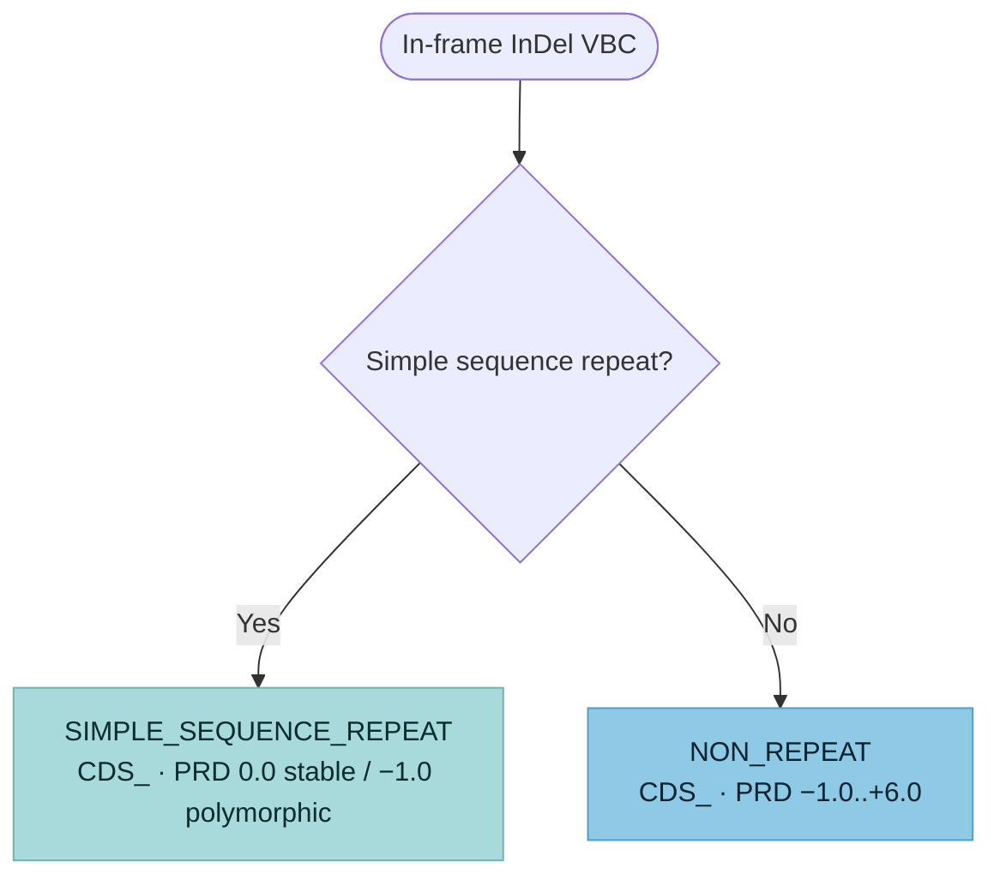

# In-Frame InDel variants (`CDS_`)

**In-frame InDels** are insertions, duplications, deletions, and insertion-deletions
that start and end within a single exon and change its length by a multiple of three
nucleotides. SVCv4 (Supplementary Material 10) routes each VBC down **one** of two
branches — a **simple sequence repeat** (SSR / tandem repeat) or a **non-repeat**
InDel — both of which always resolve to the **`CDS_`** parent code via the same
pipeline: **PRD** (predictive) → **FXN** (functional, SM 20) → **INF** (informative,
SM 19) → the capped `CDS_` total. Modeled as one `InframeIndelAssessment`
(`branch` = `InframeIndelBranch`); each step is **documented, not computed**.

!!! note "Modeled here — inputs captured"

    Both models (`InframeIndelAssessment`, `InframeIndelPredictiveEvidence`) capture
    the analyst's inputs; the scoring is documented, not computed.

## Decision tree

The branch is selected by whether the in-frame InDel lies in a simple sequence repeat.
Both branches resolve to `CDS_`. (Diagram derived from the SM 10 flow logic; not the source
figure.)

## Branches

| Branch (`branch`) | PRD initial | Held PRD+FXN | `CDS_` total |
|---|---|---|---|
| `SIMPLE_SEQUENCE_REPEAT` | `0.0` (stable in controls) / `−1.0` (polymorphic) | `−8.0 to +8.0` | `−8.0 to +10.0` |
| `NON_REPEAT` | `−1.0 to +6.0` (protein fraction / critical domain / in-silico tool) | `−8.0 to +9.0` | `−8.0 to +10.0` |

The parent code reuses `PfdParentCode` and is **always `CDS`** for in-frame InDels
(the field is kept for uniformity with the other variant-type assessments).

## Predictive (`CDS_PRD_`)

For a **simple sequence repeat** (a repeat ≥5 units), the analyst awards `0.0` if
the repeat is stable in large control sets (e.g. gnomAD) or `−1.0` if it is
polymorphic (`repeat_stable_in_controls`); a novel TRE length with unestablished
thresholds scores `0.0`. The SM 18 matrix is **not** applied on this branch.

For a **non-repeat** InDel, initial points come from a table keyed on the fraction
of protein removed (`protein_fraction_reduced`; `+6.0` for >50% removed or a
critical domain removed) and an indel **in-silico predictor** (`in_silico_predictor`
— CADD / CAPICE / PROVEAN / MutationTaster2021 / …): a **calibrated** tool reaches
`+2.0`, an **uncalibrated** one `+1.0 to −1.0` (`in_silico_calibrated`). Positive
points are then reduced by the
[Molecular Mechanism & Exon Relevance](index.md#molecular-mechanism-exon-relevance-modeled-inputs)
matrix (SM 18); the result is coded `CDS_PRD_ −1.0 to +6.0`.

## Functional (`CDS_FXN_`) and informative (`CDS_INF_`)

`FXN` reuses the generic [Functional Assays](index.md#functional-assays-modeled-inputs)
module (`FunctionalAssayEvidence`), coded `−8.0 to +8.0`. `INF` reuses the generic
[Informative Variants](index.md#informative-variants-modeled-inputs) module
(`InformativeVariantsEvidence`, SM 19): +2.0 first P / +1.0 first LP / +1.0 each
additional (negatives for B/LB), VUS → 0.0, coded `−8.0 to +8.0`. The **eligibility**
differs per branch: for an SSR, a *shorter* repeat length for pathogenic informative
variants and a *longer* one for benign; for a non-repeat InDel, an informative
variant whose predicted effect is the *same or less damaging* (pathogenic) or *same
or more damaging* (benign) than the VBC — a documented eligibility rule, not separate
fields.

*(SM 10 has two source typos in the non-repeat section: the `CDS_INF_` heading is
mislabeled `CDS_FXN_`, and the functional no-data code appears as `CDN_FXN_ND`; the
correct codes are `CDS_INF_` and `CDS_FXN_ND`.)*

## Held combined value and the `CDS_` total

Per SM 10, the model records **both** the separate coded values and the one held
`CDS_PRD_ + CDS_FXN_` combined value (`prd_fxn_combined`, no distinct code). Note the
held cap is **`−8.0 to +8.0` for the SSR branch** but **`−8.0 to +9.0` for the
non-repeat branch**, even though both *parent* totals cap at `+10.0`. The parent
total (`parent_total`) is coded `CDS_ −8.0 to +10.0`.

## Out of scope

Two situations are handled elsewhere and are **not modeled** here:

- **MDE-specific guidance** — when disease-specific repeat guidance exists (e.g.
  Huntington disease), the analyst uses that guidance and does *not* score with this
  diagram.
- **Splice effects** — an indel at/near an exon/intron junction or one that creates a
  cryptic splice site is assessed via the splice flow ([Missense](missense.md) SM 6 /
  Canonical Splice SM 11), not here.

!!! note "SM 7 cross-reference"

    The critical-domain axis (an alternative to the protein-fraction table for the
    non-repeat branch) leans on
    [Determining Critical Amino Acids (SM 7)](../../reference/spec-alignment.md) and
    is deferred to that increment.
