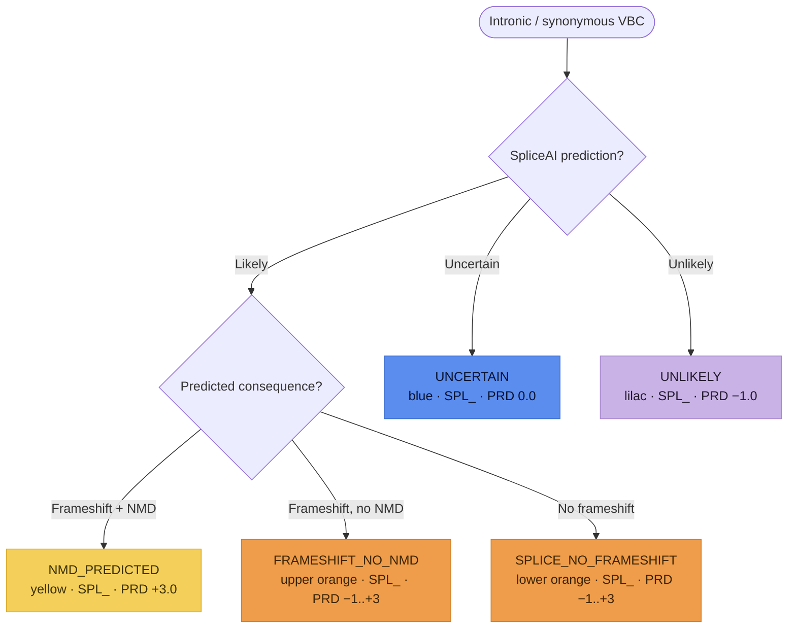

# Intronic & Synonymous variants (`SPL_`)

**Intronic variants** (SNVs / indels in an intron, *excluding* the essential ±1,2
`GT`/`AG` splice sites) and **synonymous variants** are both evaluated for their
**splicing** potential — synonymous variants because a distant splice disruption can
be pathogenic even when the variant itself is silent. SVCv4 (Supplementary Material
12) routes each VBC down **one** of five paths — the *same five* the
[Missense](missense.md) and [Canonical Splice](canonical-splice.md) flows use — all
resolving to the **`SPL_`** parent code via the shared pipeline: **SPL_PRD**
(prediction) → **SPL_SPA** (splice assay) → **SPL_FXN** (functional, SM 20) →
**SPL_INF** (informative, SM 19) → the capped `SPL_` total. Modeled as one
`IntronicSynonymousAssessment` (`prediction_outcome` = `SplicePredictionOutcome`);
each step is **documented, not computed**.

!!! note "Modeled here — inputs captured"

    `IntronicSynonymousAssessment` reuses the shared splice vocabulary
    (`SplicePredictionOutcome`, `SplicePredictiveEvidence`, `SpliceAssayEvidence`)
    and is field-identical to `CanonicalSpliceAssessment`. Only the point values
    differ (documented below); the structure is shared.

A ±1,2 dinucleotide variant whose wild-type sequence is **not** `GT`/`AG` uses *this*
flow rather than Canonical Splice (in-silico tools are less reliable for non-GT/AG
sites). Intronic genomic rearrangements / CNVs and gain-of-function effects are out
of scope here.

## Path selection (SpliceAI trichotomy)

The first decision uses an in-silico splice predictor (SpliceAI / Pangolin) chosen
consistently. Using SpliceAI's SVI-calibrated thresholds: **likely** (score > 0.2),
**uncertain** (0.1–0.2), **unlikely** (< 0.1). A high score with an ambiguous
consequence (e.g. near-equal normal-loss and cryptic-gain deltas) is treated as
**uncertain**.

Each terminal node is tinted its SM 12 color-path. (Diagram derived from the flow logic;
not the source figure.)

| Path (`prediction_outcome`) | Splice prediction | SPL_PRD initial | SPL_ total |
|---|---|---|---|
| `NMD_PREDICTED` (yellow) | likely, frameshift + NMD | `+3.0` | `−8.0 to +10.0` |
| `FRAMESHIFT_NO_NMD` (upper orange) | likely, frameshift, no NMD | `−1.0 to +3.0` | `−8.0 to +10.0` |
| `SPLICE_NO_FRAMESHIFT` (lower orange) | likely, no frameshift, no NMD | `−1.0 to +3.0` | `−8.0 to +10.0` |
| `UNCERTAIN` (blue) | uncertain | `0.0` | `−8.0 to +8.0` |
| `UNLIKELY` (lilac) | unlikely | `−1.0` | `−8.0 to 0.0` |

### Predictive (`SPL_PRD_`)

Positive initial points (yellow/orange) are reduced by the
[Molecular Mechanism & Exon Relevance](index.md#molecular-mechanism-exon-relevance-modeled-inputs)
matrix (SM 18); blue and lilac skip it. The yellow branch awards a fixed **+3.0** for
a predicted NMD event — lower than a nonsense variant's, reflecting splice-prediction
uncertainty. The orange branches read `−1.0 to +3.0` from a critical-amino-acid table
(the lower-orange path may fold in an in-frame in-silico deletion tool, `+0.5` /
`−0.5`).

### Splice assay (`SPL_SPA_`)

`SpliceAssayEvidence` captures RNA / minigene / RT-PCR evidence. Its semantics **scale
up** the SPL_PRD evidence (the missense-splice direction): for yellow it **adds** a
fraction of SPL_PRD (near-complete → +100%, substantial → +50%, incomplete/none → 0);
for orange it **doubles** (near-complete → +100%, substantial → +50%; held PRD+SPA
`−1.0 to +6.0`); for blue it is **additive** (`−2.0 to +2.0`); for lilac it adds
**benignity** (`−2.0 to 0.0`, held PRD+SPA `−3.0 to 0.0`).

### Functional (`SPL_FXN_`) and informative (`SPL_INF_`)

`SPL_FXN` reuses the generic [Functional Assays](index.md#functional-assays-modeled-inputs)
module (`FunctionalAssayEvidence`), coded `−8.0 to +8.0` (capped `−8.0 to 0.0` on the
lilac path). `SPL_INF` reuses the generic
[Informative Variants](index.md#informative-variants-modeled-inputs) module
(`InformativeVariantsEvidence`, SM 19): +2.0 first P / +1.0 first LP / +1.0 each
additional (negatives for B/LB), coded `−8.0 to +8.0` — the **lilac path restricts it
to B/LB only**. Informative variants must have the same predicted splicing impact,
and (for pathogenicity) a VBC prediction of similar-or-higher strength.

### Held combined values and the `SPL_` total

Per SM 12, the model records **both** the separate coded values and the two held
combined values (`prd_spa_combined` = SPL_PRD + SPL_SPA; `prd_spa_fxn_combined` =
SPL_PRD + SPL_SPA + SPL_FXN, capped `−8.0 to +9.0`; `−8.0 to 0.0` on the lilac path),
then the capped parent `SPL_` total (`spl_total`), whose range depends on the path
(table above).
