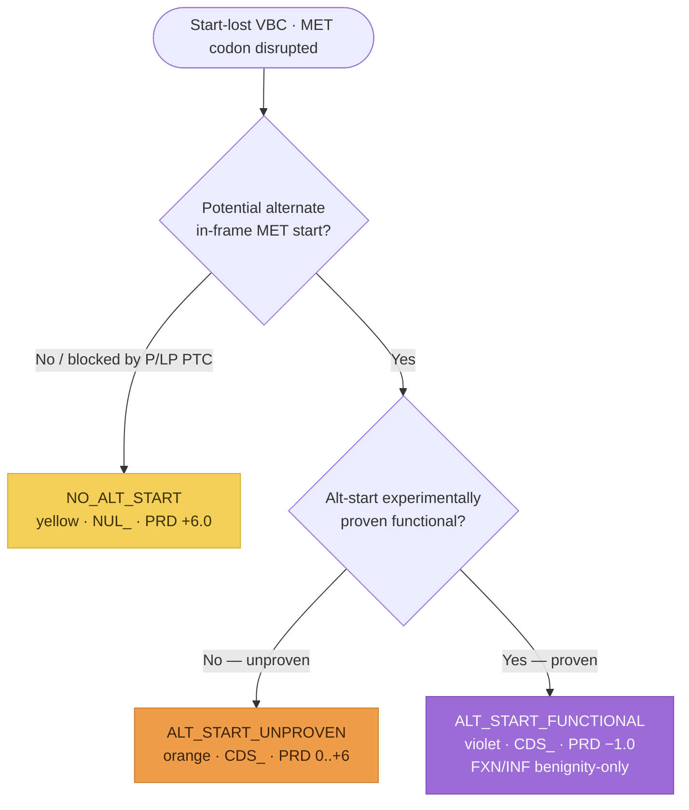

# Start-Lost variants (`NUL_` / `CDS_`)

**Start-lost variants** disrupt the initiator methionine (MET) codon. SVCv4 (Supplementary
Material 15) routes each VBC down **one** of three branches, selected at the first branch
point by the alternative start codon — is there one, and is it proven functional? Each
branch resolves to a `NUL_` or `CDS_` parent code. The yellow and orange branches run the
shared pipeline: **PRD** (predictive) → **FXN** (functional, SM 20) → **INF** (informative,
SM 19) → the capped parent total; the violet branch awards a fixed benign score. Modeled as
one `StartLostAssessment` (`prediction_outcome` = `StartLostOutcome`); each step is
**documented, not computed**.

!!! note "Modeled here — inputs captured"

    Both models (`StartLostAssessment`, `StartLostPredictiveEvidence`) capture the analyst's
    inputs; the scoring is documented, not computed.

## Decision tree

The branch is selected at the first branch point by the alternative start codon. Each
terminal node is tinted its SM 15 color-path. (Diagram derived from the SM 15 flow logic;
not the source figure.)

## Branches

| Branch (`prediction_outcome`) | Alt-start | Parent | PRD initial | Parent total |
|---|---|---|---|---|
| `NO_ALT_START` (yellow) | none, or blocked by P/LP PTC | `NUL_` | `+6.0` | `−4.0 to +10.0` |
| `ALT_START_UNPROVEN` (orange) | potential, unproven | `CDS_` | `0.0 to +6.0` | `−4.0 to +10.0` |
| `ALT_START_FUNCTIONAL` (violet) | proven functional | `CDS_` | `−1.0` (no SM 18) | `−8.0 to 0.0` |

The parent code reuses `PfdParentCode` (`NUL` / `CDS`). Note the parent floor is **−4.0**
on the yellow/orange branches (not −8.0). The `alternative_start_present`,
`rescue_blocked_by_ptc`, and `alternative_start_functional` predictive fields record the
first-branch-point decision.

## Predictive (`*_PRD_`)

The **yellow** branch applies when there is no alternate in-frame MET **or** a potential
alt-MET exists but P/LP LoF variants introduce a PTC between the VBC and the alt-MET (good
evidence rescue is unlikely — no fixed variant count; analyst judgment, variants robustly
classified or 3–4★ ClinVar). It awards a fixed **+6.0**, then applies the SM 18
mechanism/exon matrix (`NUL_PRD_0.0..+6.0`).

The **orange** branch (a plausible alt-start, no blocking P/LP PTC, no experimental data)
reads **0.0 to +6.0** from the fraction of protein deleted if the alt-start is used, or the
criticality of functional domains in the deleted segment (SM 7), then applies the SM 18
matrix (same LoF logic as yellow; `CDS_PRD_0.0..+6.0`).

The **violet** branch (an in-vitro assay shows the alternative-start protein is functional,
so a VBC upstream of it is highly likely benign) awards a fixed **−1.0** and **skips** the
SM 18 matrix (those considerations are already incorporated in the alt-start functional
evaluation).

## Functional (`*_FXN_`) and informative (`*_INF_`)

`FXN` reuses the generic [Functional Assays](index.md#functional-assays-modeled-inputs)
module (`FunctionalAssayEvidence`, `−8.0 to +8.0`, `_ND` if no data). On **yellow** the
assay must confirm transcript/protein loss (validating the translation failure); on
**orange** it must confirm the amino-terminal truncation (distinct from the data proving
alt-start usage). On **violet** `FXN` is **benignity-only** (`−8.0 to 0.0`) — pathogenic
functional data would contradict the prediction, so the analyst should reconsider the path.

`INF` reuses the generic [Informative Variants](index.md#informative-variants-modeled-inputs)
module (`InformativeVariantsEvidence`, SM 19), but is **restricted to distinct variants at
the +1/+2/+3 nucleotides of the MET codon**: +2.0 first P / +1.0 first LP or subsequent P/LP
(same MDE; pathogenicity only if similar-or-less-damaging than the VBC, benignity only if
similar-or-more-damaging). The yellow/orange branches code `INF −8.0 to +8.0`; **violet is
benignity-only** (`−8.0 to 0.0`; only B/LB at +1/+2/+3 or B/LB upstream PTC — any P/LP →
reconsider the path).

Two SM 15 specifics apply to the informative step:

- **Benignity-only extra criterion:** a B/LB variant introducing a PTC *after* the normal
  start but *upstream* of the putative alt-start counts for benignity — with no pathogenicity
  equivalent (on the yellow branch, P/LP PTC variants there were already used to award the
  initial points, so they are not re-counted as informative).
- **c.1A>C caveat (yellow/orange pathogenicity only):** because CTG can act as an initiator
  codon, a c.1A>C VBC does **not** inherit pathogenicity from P/LP variants at c.1A>T /
  c.1A>G or any +2/+3 P/LP variant.

## Held combined value and the parent total

On the yellow and orange branches the model records **both** the separate coded values and
the one held `PRD + FXN` combined value (`prd_fxn_combined`, no distinct code — orange caps
it `−8.0 to +9.0`). The parent total (`parent_total`) is coded `NUL_ −4.0 to +10.0`
(yellow), `CDS_ −4.0 to +10.0` (orange), or `CDS_ −8.0 to 0.0` (violet).

## Out of scope

Gain-of-function effects are not addressed (the workflow is LoF-framed). The SM 7
Determining Critical Amino Acids axis (the orange critical-domain criterion) is deferred,
as in every prior PFD increment.
