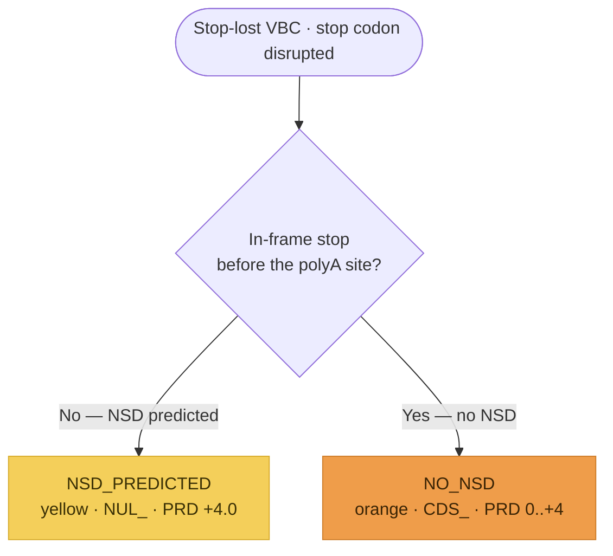

# Stop-Lost variants (`NUL_` / `CDS_`)

**Stop-lost variants** (also called nonstop, readthrough, or nonstop-extension variants)
disrupt the normal stop codon so it encodes an amino acid, extending the ORF. SVCv4
(Supplementary Material 16) routes each VBC down **one** of two branches, split at the first
branch point on the **non-stop decay (NSD)** prediction — a decay mechanism analogous to but
distinct from NMD, determined by the position of the next in-frame stop codon relative to the
polyA site. Each branch resolves to a `NUL_` or `CDS_` parent code through the shared
pipeline: **PRD** (predictive) → **FXN** (functional, SM 20) → **INF** (informative, SM 19)
→ the capped parent total. Modeled as one `StopLostAssessment` (`prediction_outcome` =
`StopLostOutcome`); each step is **documented, not computed**.

!!! note "Modeled here — inputs captured"

    Both models (`StopLostAssessment`, `StopLostPredictiveEvidence`) capture the analyst's
    inputs; the scoring is documented, not computed.

## Decision tree

The single branch point is whether an in-frame stop codon exists before the polyA site. Each
terminal node is tinted its SM 16 color-path. (Diagram derived from the SM 16 flow logic;
not the source figure.)

## Branches

| Branch (`prediction_outcome`) | NSD? | Parent | PRD initial | Parent total |
|---|---|---|---|---|
| `NSD_PREDICTED` (yellow) | yes (no in-frame stop before polyA) | `NUL_` | `+4.0` | `−8.0 to +10.0` |
| `NO_NSD` (orange) | no (in-frame stop before polyA) | `CDS_` | `0.0 to +4.0` | `−8.0 to +10.0` |

The parent code reuses `PfdParentCode` (`NUL` / `CDS`). The `nsd_predicted`,
`similar_variant_interference`, and `extension_length_aa` predictive fields record the
branch decision and the orange scoring inputs. The initial **+4.0** is lower than other LoF
flows (less experience with NSD than NMD), but the **+10.0** parent cap is retained in case
substantial functional or informative evidence exists.

## Predictive (`*_PRD_`)

The **yellow** branch (no in-frame stop before the polyA site → the mRNA is degraded by NSD)
awards a fixed **+4.0**, then applies the SM 18 mechanism/exon matrix (`NUL_PRD_0.0..+4.0`).

The **orange** branch (an in-frame stop exists before the polyA hexamer, so the protein is
extended with non-native C-terminal amino acids) has no in-silico predictor, so its initial
points come from a **four-tier scale** over the functional evidence of *similar* variants and
the predicted extension length:

| Initial | Criterion |
|---|---|
| `+4.0` | similar-variant experimental data show **loss of protein function** |
| `+3.0` | some interference evidence **AND** extension ≥30 aa past the native stop |
| `+2.0` | some interference evidence **OR** extension ≥30 aa |
| `0.0` | no functional data implicating the added C-terminal amino acids |

It then applies the SM 18 matrix (`CDS_PRD_0.0..+4.0`).

## Functional (`*_FXN_`) and informative (`*_INF_`)

`FXN` reuses the generic [Functional Assays](index.md#functional-assays-modeled-inputs)
module (`FunctionalAssayEvidence`, `−8.0 to +8.0`, `_ND` if no data). On **yellow** the assay
must confirm transcript/protein loss (validating NSD) — **not** an elongated-protein effect.
On **orange** additional functional data beyond the initial-points evidence are rarely
available, but the module is included for completeness.

`INF` reuses the generic [Informative Variants](index.md#informative-variants-modeled-inputs)
module (`InformativeVariantsEvidence`, SM 19), coded `−8.0 to +8.0`: +2.0 first P / +1.0
first LP / +1.0 each additional distinct P/LP (negatives for B/LB with similar logic; a
B/LB + P/LP mix is summed; VUS-only → 0.0; none → `_ND`; same MDE; only distinct variants
count). On **yellow** an informative P variant must produce a termination codon **downstream
of the polyA site** (its codon need not match the VBC's); on **orange** informative variants
are limited to other stop-lost variants predicted to cause an **equivalent protein
extension**.

## Held combined value and the parent total

On both branches the model records **both** the separate coded values and the one held
`PRD + FXN` combined value (`prd_fxn_combined`, no distinct code) — capped `−8.0 to +9.0`.
The parent total (`parent_total`) is coded `NUL_ −8.0 to +10.0` (yellow) or `CDS_ −8.0 to
+10.0` (orange).

## Out of scope

Not modeled here (handled by other workflows): deletions of a large portion or the entirety
of the last coding exon → [In-Frame InDel](inframe-indel.md) (SM 10) /
[Exon Deletion](exon-deletion.md) (SM 13); frameshifts that extend the ORF past the native
stop → [Frameshift](frameshift.md) (SM 9). Determining the transcript 3′ end / polyA site
(the yellow-vs-orange split) uses external tooling (a genome browser, the UCSC polyA track) —
a prose note, not modeled.
