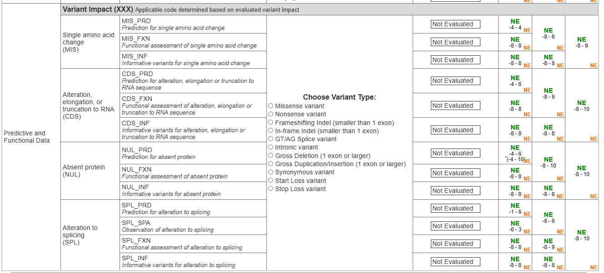

# Variant Impact

**Variant Impact** is the second top-level Evidence Category in the SVCv4 Summary
Table (alongside [Human Observational Data](human-observational-data.md)). It
covers **predictive and functional** evidence about the variant's molecular
effect. The applicable code is determined by the variant's evaluated impact
(e.g. missense, nonsense, splice, indel).

{ loading=lazy }

*The Variant Impact (Predictive & Functional) section of the SVCv4 Summary Table,
with its code workflows. (Figure provided by the SVCv4 Standards group.)*

!!! note "Not yet modeled here"

    Variant Impact is specified by the SVCv4 Standards but is **not yet covered
    by this data model**. This page summarizes its concepts; detailed modeling is
    a later phase.

## Concepts and codes

Each concept uses a common code pattern: **`_PRD`** (prediction), **`_FXN`**
(functional assessment), **`_INF`** (informative variants), plus **`_SPA`**
(observation) for splicing.

| Concept | Codes |
|---|---|
| **Single amino-acid change (MIS)** | `MIS_PRD`, `MIS_FXN`, `MIS_INF` |
| **Alteration/elongation/truncation to RNA (CDS)** | `CDS_PRD`, `CDS_FXN`, `CDS_INF` |
| **Absent protein (NUL)** | `NUL_PRD`, `NUL_FXN`, `NUL_INF` |
| **Alteration to splicing (SPL)** | `SPL_PRD`, `SPL_SPA`, `SPL_FXN`, `SPL_INF` |

<!-- VERIFY: Variant Impact concept/code roster and the PRD/FXN/INF/SPA pattern transcribed from the "Predictive and Functional Data w/ Workflows" Summary Table graphic; confirm with the SVCv4 WG. -->

Scoring for these codes is defined in
[ClinGen CSpec](../reference/cspec-interop.md).
